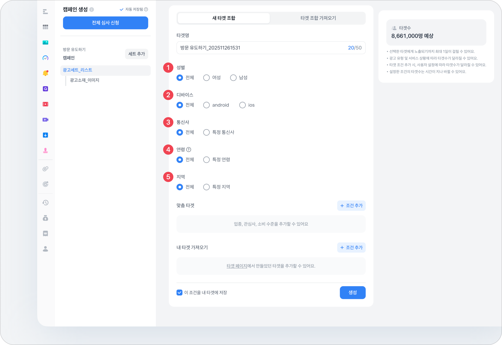

# 광고 세트 설정하기

## 배너 광고 세트 만들기



#### 광고 세트 정보

<figure><figcaption></figcaption></figure>

1. **광고 유형**
   * 캠페인 단에서 설정한 캠페인 목표에 따른 광고 유형을 선택할 수 있어요.
2. **광고 세트 명**
   * 광고 세트 명을 입력하는 영역이에요.
3. **일 예산 (부가세 제외)**
   * 캠페인 예산 한도 내에서 광고 세트 단위로 1일 집행 가능한 예산을 설정할 수 있어요.
   * 설정한 일 예산은 광고 집행 중 변경이 가능해요.
   * 하위 광고 소재가 여러 개인 경우, 효율이 가장 좋은 소재에서 예산을 많이 소진되는 최적화 로직이 적용돼요.
   * 광고 세트의 일 예산을 설정할 수 있어요.
4. **입찰 방식**
   * 자동 입찰 클릭 최대화: 클릭을 최대화하기 위해, 주어진 일예산을 최대한 소진하면서도 가장 효율적인 CPC(클릭당 단가)를 얻기 위해 플랫폼이 자동으로 입찰을 결정해요.
   * 자동 입찰 tCPA: 목표 전환당 비용(tCPA)을 달성하기 위해, 전환 가능성이 높은 유저에게 플랫폼이 자동으로 입찰을 결정해요.
   * 직접 입찰 CPC: 광고가 클릭될 때마다 과금되는 방식으로, 클릭당 금액을 직접 설정해요.
   * 직접 입찰 CPM: 광고가 1,000회 노출될 때마다 과금되는 방식으로, 1,000회 노출당 금액을 직접 설정해요.
5. **노출 기간**
   * 광고 세트 노출 기간을 설정하실 수 있어요.
   * 캠페인 기간과 동일 옵션을 선택하실 경우 광고 세트가 속한 캠페인의 기간과 동일하게 노출이 진행돼요.
6. **노출 시간**
   * 상시 노출 값으로 기본 적용돼요.
   * 노출 시간대 설정을 클릭하실 경우 간단하게 노출 시간대를 설정할 수 있어요.
   * 요일 별 시간대 설정을 클릭하실 경우 노출 요일과 시간을 설정할 수 있어요.
     * 검은색으로 칠해지는 시간대 및 요일에 광고가 노출돼요.

***



#### 광고 타겟 설정하기

* **타겟이란?**
  * 배너 광고가 노출 될 대상 사용자 (오디언스) 그룹을 의미해요.
  * **새 타겟 설정하기**를 통해 처음부터 조건을 설정하여 새로운 타겟을 만들거나,**생성된 타겟 선택하기**를 통해 기존에 생성해둔 타겟을 불러와서 사용할 수 있어요. 

<figure><figcaption></figcaption></figure>

#### 데모그래피

1. **성별**

* 남성/여성을 타겟팅할 수 있으며, 전체를 클릭하면 성별과 관계 없이 모두를 타겟팅 할 수 있어요.
* 성별은 사용자가 직접 등록한 정보 또는 추정된 정보에 근거하며, 실제와 다를 수 있어요.

2. **디바이스**

* 광고 타겟의 모바일 운영체제를 설정할 수 있으며, Android 혹은 iOS를 선택할 수 있어요.\
  PC 기기에 대해서는 지원하지 않아요.
* 광고를 본 사용자의 디바이스 정보가 정확하지 않은 경우 디바이스 기반의 타겟팅이 정상적으로 동작하지 않을 수 있어요.

3. **통신사**

* 광고 타겟의 특정 통신사 정보를 설정할 수 있으며, 전체를 클릭하면 통신사 정보와 관계 없이 모두를 타겟팅할 수 있어요.
* 특정 통신사 정보는 여러 개 동시에 설정 할 수 있어요.

4. **연령**

* 만 19세 이상부터 만 나이 기준으로 5\~6세 단위로 설정할 수 있으며, 70세 이상은 “70세 이상” 으로 설정할 수 있어요.
* 연령은 사용자가 직접 등록한 정보 또는 추정된 정보에 근거하며, 실제와 다를 수 있어요.

5. **지역**

* 광고 타겟의 거주 지역을 설정할 수 있으며, 전체를 클릭하면 지역과 관계 없이 모두를 타겟팅할 수 있어요.
* 지역 타겟팅은 2단계 (도>시, 특별/광역시>구) 등으로 설정할 수 있으며, 여러 지역을 동시에 설정할 수 있어요.
* 지역은 사용자가 직접 등록한 정보 또는 추정된 지역 정보에 근거하며 실제와 다를 수 있어요.

***

#### 광고 타겟 정보 설정하기

<figure><figcaption></figcaption></figure>

**맞춤 타겟**

> 맞춤 타겟을 다른 타겟팅 옵션과 여러 개 사용할 경우, 타겟 모수가 너무 작아져 광고 효과가 감소할 수 있으니 주의해서 사용하시는 것을 권장해요.

 

<figure><figcaption></figcaption></figure>

**업종 카테고리**

* 업종 카테고리는 특정 업종 카테고리에 결제를 했거나 하지 않은 사용자를 찾을 수 있게 해주는 광고 타겟팅 옵션이에
  * 3단계 (대 카테고리 > 중 카테고리 > 소 카테고리) 등으로 설정할 수 있으며, 여러 업종을 동시에 설정할 수 있어요.
* 업종 카테고리 안에서 여러 개의 업종을 선택한 경우, 모든 업종에 대한 합집합(포함)으로만 선택할 수 있어요.
  * 여러 조건의 업종 카테고리 활용 맞춤 타겟을 선택한 경우에도, 모든 조건에 대한 합집합 (포함) 으로 사용돼요.
* 업종을 선택한 이후에, 상세 타겟 조건 (결제 기간, 결제 금액, 결제 횟수) 을 추가로 선택할 수 있어요.\
   

<figure><figcaption></figcaption></figure>

**관심 · 속성 정보**

* 관심 · 속성 정보는 토스 내 특정 서비스 이용 이력을 바탕으로 사용자의 관심사를 유추하여 찾을 수 있게 해주는 광고 타겟팅 옵션이에요.
  * 2단계 (대 카테고리 > 소 카테고리) 로 설정할 수 있으며, 여러 관심사를 동시에 설정할 수 있어요.

<figure><figcaption></figcaption></figure>

**소비 수준**

* 소비 수준은 사용자의 최근 월 평균 결제 금액을 기반으로 하여 소비 금액의 분포를 찾을 수 있게 해주는 광고 타겟팅 옵션이에요.\
  여러 타겟을 동시에 설정할 수 있어요.\
   

***

#### 광고 반응 가져오기

#### 광고 반응 가져오기

<figure><figcaption></figcaption></figure>

* 해당 광고 계정에서 기존에 집행했던 광고 타겟의 행동 이력을 바탕으로 타겟에서 포함하거나 제외할 수 있는 타겟팅 옵션이에요.
* 기존 집행한 광고 타겟을 선택하고, 해당 타겟의 상세 행동 (예, 클릭한 유저) 조건을 선택하여 포함하거나 제외할 수 있어요.
* **광고 반응 타겟은 3개까지 적용 가능하고 동일한 조건의 타겟은 중복 설정할 수 없어요.** 

#### 전환 추적 가져오기

<figure><figcaption></figcaption></figure>

* 상세한 내용은 [전환 추적 타겟](https://toss-ads.gitbook.io/guide/resources/target/switch) 페이지에서 확인할 수 있어요.
* **전환 추적 타겟은 최대 10개까지 적용 가능해요.**

#### 고객 목록 가져오기

<figure><figcaption></figcaption></figure>

* 상세한 내용은 [고객 목록 타겟](https://toss-ads.gitbook.io/guide/resources/target/list) 페이지에서 확인할 수 있어요.
* **고객 목록 가져오기는 최대 1개까지 적용 가능해요.**

***



### 광고 타겟 정보 확인하기

<figure><figcaption></figcaption></figure>


유의 사항

* 서비스 별 필요 조건, 사용자 별 설정에 따라 예상 타겟 규모가 달라질 수 있어요.
* 선택한 타겟 조건 및 측정된 데이터가 시간에 지남에 따라 예상 타겟 규모가 달라질 수 있어요.
* 선택한 조건에 맞는 타겟을 생성하는 데 최대 1일이 소요될 수 있으므로, 세트를 생성/추가하는 경우 즉시 반영되지 않을 수 있어요.


* 광고유형과 설정한 타겟 조건에 따라 상단 <예상 타겟> 섹션을 통해 해당되는 타겟의 예상 규모를 확인할 수 있어요.
* \[타겟 생성 완료] 버튼을 눌러야 최종적으로 광고 타겟이 설정되어 소재를 생성할 수 있어요.
* 예상 타겟 규모가 50,000명 미만인 경우 광고를 집행할 수 없어요.\
  예상 타겟 규모가 50,000명 미만으로 조회되는 경우, 타겟 조건을 완화하여 설정해 주세요. 

***



### 타겟 최적화(beta)

<figure><figcaption></figcaption></figure>

* 토스가 전환 가능성이 높은 유저를 정밀하게 타겟하는 **자동 타겟팅 기능**이에요.
  * 캠페인 목표와 기본 설정된 타겟을 중심으로 토스가 전환 가능성이 높은 타겟으로 최적화해요.
  * 토스애즈로 수집된 **다양한 전환 데이터를 기반으로 점진적으로 타겟이 최적화돼요.**
* 캠페인 목표 \[잠재 고객 모으기], \[구매 유도하기], \[앱 설치 유도하기] 에서 타겟 최적화 기능을 제공해요.
* 타겟 최적화는 현재 **베타 기능**으로 서비스 안정성과 최적화 성능을 계속해서 개선하고 있어요.



### 광고 세트 삭제

* 광고 세트는 삭제 후 되돌릴 수 없어요.
  * 노출 (광고 집행) 이력이 없는 캠페인 및 광고 세트는 삭제할 수 있어요.
  * 노출 (광고 집행) 이력이 있는 캠페인 및 광고 세트는 삭제할 수 없어요.


