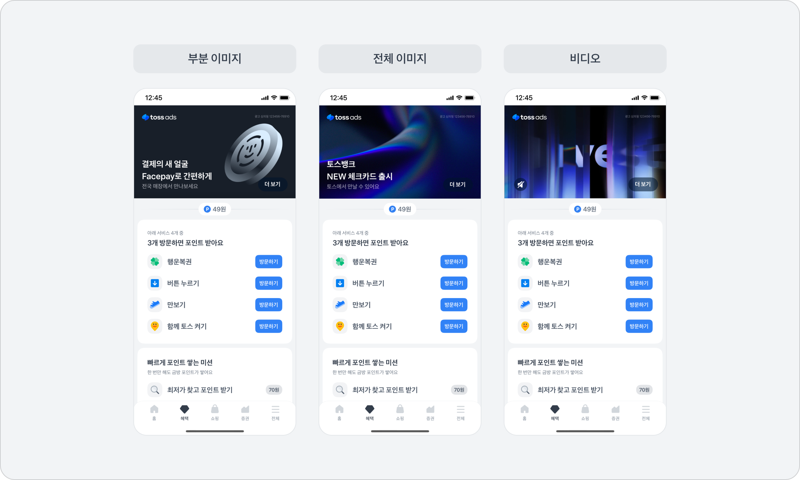

# 보드 배너

<table data-view="cards"><thead><tr><th></th><th data-type="content-ref"></th><th data-hidden data-card-cover data-type="image">Cover image</th><th data-hidden data-card-target data-type="content-ref"></th></tr></thead><tbody><tr><td>보드 부분 이미지</td><td><a href="thumbnail.md#undefined-2">#undefined-2</a></td><td data-object-fit="fill"><a href="../../../.gitbook/assets/스크린샷 2025-10-07 오전 12.58.07 1.png">스크린샷 2025-10-07 오전 12.58.07 1.png</a></td><td><a href="thumbnail.md#undefined-2">#undefined-2</a></td></tr><tr><td>보드 전체 이미지 </td><td><a href="thumbnail.md#undefined-3">#undefined-3</a></td><td><a href="../../../.gitbook/assets/스크린샷 2025-10-07 오전 12.58.26 1.png">스크린샷 2025-10-07 오전 12.58.26 1.png</a></td><td><a href="thumbnail.md#undefined-3">#undefined-3</a></td></tr><tr><td>보드 비디오  </td><td><a href="thumbnail.md#undefined-6">#undefined-6</a></td><td data-object-fit="fill"><a href="../../../.gitbook/assets/스크린샷 2025-10-07 오전 12.57.50 1.png">스크린샷 2025-10-07 오전 12.57.50 1.png</a></td><td><a href="thumbnail.md#undefined-6">#undefined-6</a></td></tr></tbody></table>

<figure><figcaption></figcaption></figure>

* 소재 심사 규정에 따라  **평어체 (반말)** 를 사용할 수 없고 맞춤법에 어긋나는 표현 혹은 신조어는 포함되지 않아야 해요.
* 보드 배너 유형 별 심의필 가이드를 확인하여 올바른 방법으로 심의 문구를 입력해주세요.

***

## 이미지 유형 설정 가이드&#x20;

* [업종 별 심사 가이드](../../../policy/industryguide.md#id-1)에 따라 심의필 제출이 필수 업종인 경우, 카테고리를 선택하고 안내 문구 기재란에 작성해주시면 이미지 상단 영역에 자동으로 반영돼요.



<figure><figcaption></figcaption></figure>

* **부분 이미지 타입**

<figure><figcaption></figcaption></figure>

* 광고 이미지 : 1200\*1200 사이즈 png 이미지 (10mb 이하)
* <mark style="color:$info;">배경 색상 : 8가지 색상 중 1가지 선택이 가능해요.</mark>
  * <mark style="color:$info;">광고 문구와 이미지의 가독성을 높일 수 있는 색상을 선택해주세요.</mark>&#x20;
* **브랜드 로고**
  * 가로 600 사이즈 이상의 png 이미지를 사용해주세요.
  * 투명한 배경의 여백이 없는 이미지 사용을 권장해요.&#x20;
  * 주요 문구 또는 보조 문구에 브랜드명을 기재한 경우에만 \[로고 없음] 버튼을 눌러 생략 가능해요.&#x20;
* **주요 문구 (필수)**&#x20;
  * &#x20;공백 포함 28자 입력 가능하고 2행 까지 줄바꿈이 가능해요. (한 행에 최대 14자 입력 가능)&#x20;
    * 큰 혜택 또는 메인 이벤트 정보가 드러나는 문구를 기재해주세요.
* **보조 문구 (선택)**&#x20;
  * 공백 포함 최대 16자 입력 가능해요.
  * 혜택 또는 이벤트의 세부 내용을 기재하는 영역이에요.
  * 보조 문구는 \[사용 안 함] 버튼을 눌러 생략 가능해요.&#x20;
* **참고 문구 추가 (선택)**&#x20;
  * 광고 심의를 위해 필수 기재 되어야 하는 문구만 입력 가능하고 단순 정보 전달성 문구와 같은 기타 문구 입력 시 심사 반려될 수 있어요.    &#x20;
  * 한 행당 공백 포함 최대 39자 입력 가능하고 2행 까지 줄바꿈 가능해요. (공백 포함 78자 입력 가능)&#x20;
* **브랜드명**&#x20;
  * 광고 소재에 반영되지 않고 광고 심사 또는 토스애즈 수집용으로 활용돼요.
    * 실제로 광고 집행하는 브랜드명을 입력해주세요.
* 광고 소재의 가독성을 떨어뜨리는 이미지는 광고 집행이 불가해요.
  * 단순 정보 전달성 문구는 주요,보조 문구 입력란을 활용해주세요.

<figure><figcaption></figcaption></figure>

* 우측 하단에 위치한 행동 유도 버튼과 이미지의 일부 요소가 겹치지 않도록 구성해주세요.&#x20;
  * 일부 요소와 겹쳐보이거나 가려지는 경우 심사 반려될 수 있어요.

<figure><figcaption></figcaption></figure>

* 작게 분할 되거나 3개 이상 복잡한 오브젝트로 구성된 이미지는 심사 반려될 수 있어요.

<figure><figcaption></figcaption></figure>



<figure><figcaption></figcaption></figure>

* **전체 이미지 타입**
  * 광고 이미지 : 배경색이 있는 1200\*675 사이즈 png, jpg 이미지 (10mb 이하)
  * 주요 문구와 겹치지 않도록 주요 사물이 우측에 배치된 이미지 사용을 권장해요.&#x20;
* **브랜드 로고**
  * 가로 600 사이즈 이상의 png 이미지&#x20;
  * 투명한 배경의 여백이 없는 이미지 사용을 권장해요.&#x20;
  * 주요 문구 또는 보조 문구에 브랜드명을 기재한 경우에만 \[로고 없음] 버튼을 눌러 생략 가능해요.&#x20;
* **주요 문구 (필수)**&#x20;
  * &#x20;공백 포함 28자 입력 가능하고 2행 까지 줄바꿈이 가능해요. (한 행에 최대 14자 입력 가능)&#x20;
    * 큰 혜택 또는 메인 이벤트 정보가 드러나는 문구를 기재해주세요.
* **보조 문구 (선택)**&#x20;
  * 공백 포함 최대 16자 입력 가능해요.
  * 혜택 또는 이벤트의 세부 내용을 기재하는 영역이에요.
  * 보조 문구는 \[사용 안 함] 버튼을 눌러 생략 가능해요.
* **참고 문구 추가 (선택)**&#x20;
  * 광고 심의를 위해 필수 기재 되어야 하는 문구만 입력 가능하고 단순 정보 전달성 문구와 같은 기타 문구 입력 시 심사 반려될 수 있어요.    &#x20;
  * 한 행당 공백 포함 최대 39자 입력 가능하고 2행 까지 줄바꿈 가능해요. (공백 포함 78자 입력 가능)&#x20;
* **광고 문구색**
  * 광고 이미지 배경색에 따라 가독성 높은 색상을 선택해주세요.&#x20;
    * 광고 문구색 : 화이트 또는 블랙 색상 중 선택할 수 있어요.
    * 참고 문구 및 안내 문구색 : 그레이 또는 화이트 중 선택할 수 있어요.
* **브랜드명**&#x20;
  * 광고 소재에 반영되지 않고 광고 심사 또는 토스애즈 수집용으로 활용돼요.
    * 실제로 광고 집행하는 브랜드명을 입력해주세요.&#x20;
* 광고 소재의 가독성을 떨어뜨리는 이미지는 광고 집행이 불가해요.
  * 단순 정보 전달성 문구는 주요,보조 문구 입력란을 활용해주세요.

<figure><figcaption></figcaption></figure>

* 우측 하단에 위치한 행동 유도 버튼과 이미지의 일부 요소가 겹치지 않도록 구성해주세요.
  * 일부 요소와 겹쳐보이거나 가려지는 경우 심사 반려될 수 있어요.

<figure><figcaption></figcaption></figure>

* 작게 분할 되거나 3개 이상 복잡한 오브젝트로 구성된 이미지는 심사 반려될 수 있어요.



* [**유저가 접속할 때 이상이 없어야 해요**](../../../policy/creativeguide.md#id-5)
  * 앱으로 랜딩된다면, 앱 미설치 유저는 앱 스토어 / 구글 플레이스토어로 랜딩될 수 있어야 해요.
  * 랜딩 과정에서 접속하는 데 5초 이상 걸리는 경우, 브릿지 페이지를 만들어 주세요.
* [**랜딩/이벤트 페이지의 내용과 소재 내용이 일치해야 해요**](../../../policy/creativeguide.md#id-6)
  * 랜딩 / 이벤트 페이지에서 확인할 수 없는 혜택, 정보는 광고 승인이 불가해요.
  * 가입 또는 응모와 같이 선행 조건이 따르는 혜택은 광고 문구 내에 반드시 명시해야만 사용할 수 있어요.
* [**URL 주소는 반드시 영문으로 제출해주셔야 해요**](../../../policy/creativeguide.md#id-4)
  * 주소에 한글이 있는 경우 오류가 발생할 수 있어요.
  * 링크 내에 <mark style="color:red;">{ } ^ #</mark> 문구가 있으면 반려될 수 있어요.
    * <mark style="color:red;">^</mark> 대신 <mark style="color:red;">\_</mark>(언더바)를 사용해주세요.
  * <mark style="color:red;">http://</mark> 는 사용이 불가하여 <mark style="color:red;">https://</mark> 를 사용해주세요.
* **앱스플라이어로 생성한 원링크를 제출할 경우, 파라미터가 단축되지 않은 원본 롱링크를 제출해 주세요.**
* **숏링크/단축 URL 형태는 사용할 수 없어요. (비틀리 포함)**
* **이외의 사유로 CTA 링크에 이슈가 있다고 판단되는 경우, 링크를 재요청 할 수 있어요.**



***

## 영상 유형 설정 가이드&#x20;

* [업종 별 심사 가이드](../../../policy/industryguide.md#id-1)에 따라 심의필 제출이 필수 업종인 경우 반드시 심의필 문구를 영상 내에 동일하게 기재해 주세요.
  * 보드 영상 유형은 심의필 문구가 자동 반영되지 않아요 영상 리소스 내에 직접 기재하여 광고를 집행해야 해요.
  * 안내 문구 입력란(토스애즈 시스템)에 기재된 심의필 문구와 영상 내에 심의필 문구가 다른 경우 심사 반려될 수 있어요.



<figure><figcaption></figcaption></figure>

* **영상 리소스**
  * 영상 길이 : 최소 5초 - 최대 120초 (2분) **( 15초/30초 영상 사용 권장 )**
  * 영상 지원 형식: MP4, MOV, WebM
  * 영상 파일 크기: 500MB 미만
  * 권장 프레임 속도: 24fps 또는 30fps
  * 영상 지원 화면비 : 16:9&#x20;
  * 영상 해상도 : 최소  720p 이상 (1080p 권장)&#x20;
  * **코덱 사양 :** 영상 H.264 / 오디오 AAC
* **iOS, Android 모바일 환경에서 소리와 영상이 정상적으로 재생되어야 해요.**
  * 특정 운영체제에서 재생 오류가 발생하는 경우 심사 반려될 수 있어요.
*   **아래와 같이 동영상의 가독성과 질이 떨어지는 경우 광고 집행이 제한되며, 수정을 요청할 수 있어요.**

    1. 광고를 접한 유저의 추가 행동 및 조치 없이 사운드가 자동 송출 되거나 음량이 지나치게 큰 경우
    2. 동영상 내 텍스트, 스틸컷 등의 비중이 높은 경우
    3. 동일한 creative가 연속으로 반복되는 경우
    4. 화질이 지나치게 저하되어 가독성이 떨어지는 경우
    5. 지나친 섬광효과나 공포 유발로 유저에게 불편함을 주는 경우
       1. 영상 시작 10초 내 3초 이상 섬광효과, 피, 흉기, 귀신, 괴물 등의 노출이 지속되는 경우
       2. &#x20;5초이상 연속해서 섬광효과, 피, 흉기, 귀신, 괴물 등의 노출이 지속되는 경우
       3. 전체 영상의 50% 이상 섬광 효과나 직접적인 공포 표현을 사용하는 경우
       4. 초수가 짧더라도, 놀람을 유발할 목적으로 급작스럽게 화면 등이 전환되며 공포를 유발하는 소재가 전면에 등장하는 경우
    6. 화면이 분할되어 여러가지 영상이 동시에 노출되는 경우
       1. 3초이상 연속해서 분할컷 이미지가 노출되는 경우

* 썸네일 (정지화면) 은 영상 내 화면을 1초 단위로 설정할 수 있고 섬광 효과나 공포감을 유발하는 구간은 썸네일로 설정할 수 없어요.
* 노출 지면에 따라 우측 하단에 위치한 음소거 버튼,행동 유도 버튼 등의 요소가 있어 영상 내에 일부 요소가 겹치지 않도록 구성해주세요.

<figure><figcaption></figcaption></figure>


* 유저의 디바이스 설정 및 기종에 따라 영상 테두리 일부가 소폭 잘려 보이거나 소재 미리보기 화면과 상이할 수 있어요




* [**유저가 접속할 때 이상이 없어야 해요**](../../../policy/creativeguide.md#id-5)
  * 앱으로 랜딩된다면, 앱 미설치 유저는 앱 스토어 / 구글 플레이스토어로 랜딩될 수 있어야 해요.
  * 랜딩 과정에서 접속하는 데 5초 이상 걸리는 경우, 브릿지 페이지를 만들어 주세요.
* [**랜딩/이벤트 페이지의 내용과 소재 내용이 일치해야 해요**](../../../policy/creativeguide.md#id-6)
  * 랜딩 / 이벤트 페이지에서 확인할 수 없는 혜택, 정보는 광고 승인이 불가해요.
  * 가입 또는 응모와 같이 선행 조건이 따르는 혜택은 광고 문구 내에 반드시 명시해야만 사용할 수 있어요.
* [**URL 주소는 반드시 영문으로 제출해주셔야 해요**](../../../policy/creativeguide.md#id-4)
  * 주소에 한글이 있는 경우 오류가 발생할 수 있어요.
  * 링크 내에 <mark style="color:red;">{ } ^ #</mark> 문구가 있으면 반려될 수 있어요.
    * <mark style="color:red;">^</mark> 대신 <mark style="color:red;">\_</mark>(언더바)를 사용해주세요.
  * <mark style="color:red;">http://</mark> 는 사용이 불가하여 <mark style="color:red;">https://</mark> 를 사용해주세요.
* **앱스플라이어로 생성한 원링크를 제출할 경우, 파라미터가 단축되지 않은 원본 롱링크를 제출해 주세요.**
* **숏링크/단축 URL 형태는 사용할 수 없어요. (비틀리 포함)**
* **이외의 사유로 CTA 링크에 이슈가 있다고 판단되는 경우, 링크를 재요청 할 수 있어요.**


