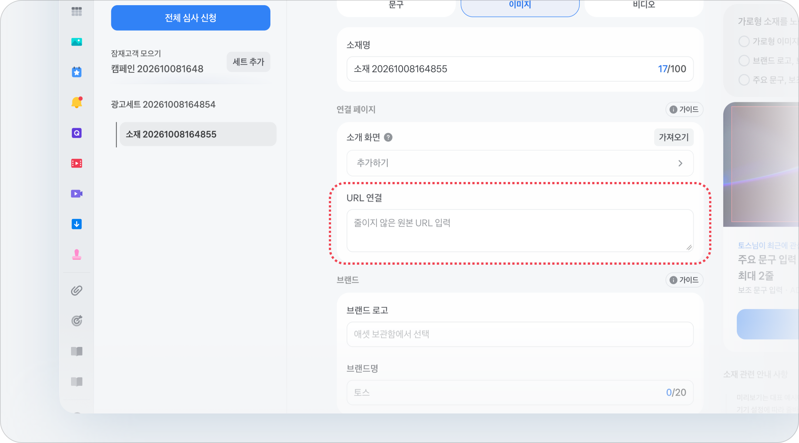

# 양식 등록 방식 - 외부 URL

외부 URL은 토스에서 **소개 화면**(브릿지 페이지)으로 혜택을 보여준 뒤, 유저를 광고주의 **랜딩 페이지**로 보내는 방식이에요.

이 가이드를 보면 외부 URL을 선택한 캠페인의 소개 화면을 만들고 랜딩 URL까지 연결할 수 있어요.&#x20;

유저가 소개 화면으로 들어오기 위해 누르는 **광고 배너**는 [배너 소재 가이드](banner-guide/)에서 확인해 주세요.


**캠페인에서 양식 등록 방식을 토스 양식으로 선택했나요?**

[토스 양식 가이드](toss-form.md)를 확인해 주세요.


## 소개 화면 만들고 URL 연결하기

캠페인 설정의 **양식 등록 방식**에서 **외부 URL**을 선택했다면, 소재 설정에서 아래 순서대로 진행해 주세요.



### 소개 화면 추가하기

* 소재 설정의 **연결 페이지 > 소개 화면**에서 **추가하기**를 눌러 주세요.
* 이미 만든 소개 화면을 다시 쓰려면 **가져오기**를 눌러 주세요.

<figure><figcaption></figcaption></figure>




### 소개 화면 이름 입력하기

**소개 화면 만들기** 창에 양식 이름을 입력하고 **다음**을 눌러 주세요.

* 공백 포함 최대 50자까지 입력할 수 있어요.
* 저장한 뒤에도 편집 화면 왼쪽 위 **이름 수정**으로 바꿀 수 있어요.

<figure><figcaption></figcaption></figure>




### 소개 화면 작성하기

소개 화면은 유저가 광고를 눌렀을 때 가장 먼저 보는 화면이에요. 어떤 혜택을 받을 수 있는지 보여주고, 유저가 버튼을 눌러 랜딩 페이지로 넘어가게 해요.&#x20;

<mark style="color:red;">**소개 화면은 필수예요. 소개 화면이 없으면 소재 심사에서 반려될 수 있어요.**</mark>

<mark style="color:red;">**반드시 아래 탭 내용을 확인해 주세요.**</mark>




**반드시 지켜 주세요**

* 문장은 명사형 또는 \~해요체로 써야 해요.
* 초성은 쓸 수 없어요.


화면 맨 위, 배경 이미지 위에 얹혀서 보이는 문구예요.

전달하려는 정보는 이미지에 넣지 말고 **설명 문구** 입력란을 활용해 주세요.

브랜드명과 제목이 얹히는 이미지 위쪽 영역은 자동으로 블러·그라디언트 처리돼요.&#x20;

| 입력란      | 규정                                              |
| -------- | ----------------------------------------------- |
| **브랜드명** | 공백 포함 최대 20자.                                   |
| **제목**   | 
공백 포함 최대 24자. 

줄바꿈해서 두 줄로 입력해 주세요.
 |




**반드시 지켜 주세요**

* 안전 노출 영역(가운데 640px)에 문구를 넣지 마세요.
* 배경이 없는 이미지(누끼 딴 이미지)나 흰 배경 이미지는 쓸 수 없어요.


소개 화면의 배경으로 보이는 이미지예요. 위쪽은 상단 문구가 얹혀서 흐려지고, 아래쪽은 혜택 카드에 가려져요.

**입력 규정**

* 크기: 900px x 1200px
* 형식: JPG, JPEG, PNG (파일당 10MB 이하)
* 텍스트가 없는 이미지를 사용해 주세요. (전달하려는 정보는 **설명 문구** 입력란을 활용해 주세요.)

**영역별 노출 방식**

<table><thead><tr><th width="128">영역</th><th width="107.5">위치</th><th>이렇게 보여요</th><th>문구를 넣으면</th></tr></thead><tbody><tr><td>자동 블러·그라디언트 영역</td><td>위쪽 500px</td><td>
브랜드명과 제목이 겹치고, 자동으로 흐려져요. 

주요 피사체를 두지 말고 대비가 약한 배경으로 채워 주세요.
</td><td>반려하지 않아요. 다만 잘 안 보여요.</td></tr><tr><td>안전 노출 영역</td><td>가운데 640px</td><td>이미지가 그대로 보여요.  주요 피사체와 그래픽은 여기에 두세요.</td><td><strong>반려돼요.</strong> 혜택 문구는 설명 문구에 써 주세요.</td></tr><tr><td>가려지는 영역</td><td>아래쪽 60px</td><td>혜택 카드에 가려질 수 있어요.  중요한 요소를 두지 말아 주세요.</td><td>반려하지 않아요. 다만 가려져요.</td></tr></tbody></table>

<figure><figcaption></figcaption></figure>




**반드시 지켜 주세요**

* 의료·미용·금융처럼 혜택 광고가 법으로 제한된 업종은 '일반'을 골라 주세요.


소개 화면의 메인 타이틀을 정하는 항목이에요. 두 가지 유형 중에서 고르면 메인 타이틀이 아래와 같이 고정돼요.

| 유형     | 메인 타이틀 (고정)   | 이럴 때 선택해요                                 |
| ------ | ------------- | ----------------------------------------- |
| **혜택** | 이런 혜택을 드려요    | 이벤트 참여로 유저가 받는 혜택이 있을 때                   |
| **일반** | 자세히 상담 받아 보세요 | 혜택과 관련 없는 내용이거나, 혜택 제공 문구가 법적으로 제한된 업종일 때 |

<figure><figcaption></figcaption></figure>




**반드시 지켜 주세요**

* 심의필이 필요한 업종이라면 안내 문구를 꼭 입력해 주세요.


설명 문구 맨 아래에 작게 들어가는 **광고 고지 문구**예요.

**입력 규정**

* 심의필이 필요하지 않은 업종은 **문구 없음**을 선택해 주세요.
* 최대 80자까지 입력할 수 있어요.
* 예시) 준법감시인확인필 제26-B09-123호(2026-09-10 \~ 2027-09-11)




**반드시 지켜 주세요**

* 리스트에 특수문자나 이모지를 넣지 마세요.
* 문장은 명사형 또는 \~해요체로 써야 해요.
* 초성은 쓸 수 없어요.


**입력 규정**

* 리스트는 최소 2개, 최대 6개까지 넣을 수 있어요. **리스트 추가하기**로 추가하고, 필요 없는 리스트는 빼 주세요.
* 리스트 형태는 1줄과 2줄 중에서 골라요.

| 형태     | 입력란     | 규정                                 |
| ------ | ------- | ---------------------------------- |
| **1줄** | 제목      | 혜택 내용, 공백 포함 18자.                  |
| **2줄** | 제목 + 설명 | 혜택 내용 공백 포함 18자 + 부가 설명 공백 포함 20자. |

<figure><figcaption></figcaption></figure>




이 항목은 반려 기준이 없어요. 아래 선택지 중에서 고르면 돼요.


소개 화면 맨 아래 버튼에 들어가는 문구예요. 유저가 이 버튼을 누르면 광고주의 랜딩 페이지로 넘어가요.&#x20;

유저가 다음 화면에서 하게 될 행동과 맞는 문구를 아래 선택지 중에서 골라 주세요.

* 상담 신청하기
* 상담 시간 고르기
* 연락처 남기기
* 이벤트 참여하기
* 체험 신청하기
* 견적 받아보기
* 구경하기
* 신청하기
* 가입하기


외부 URL은 이 버튼을 누를 때 과금돼요. 소개 화면을 거치지 않는 지면에서는 광고 배너를 누를 때 과금돼요.







### 저장하기

모든 항목을 입력했는지 확인하고, 오른쪽 위 **저장**을 눌러 주세요.

저장한 소개 화면은 소재 설정의 **연결 페이지 > 소개 화면**에 연결돼요.




### URL 연결하기

연결 페이지의 **URL 연결**에 유저를 보낼 랜딩 페이지 주소를 입력해 주세요. 줄이지 않은 원본 URL을 입력해야 해요.

<figure><figcaption></figcaption></figure>

* [**유저가 접속할 때 이상이 없어야 해요**](https://toss-ads.gitbook.io/guide/review/creativeguide#landing-access)**.**
  * 앱으로 랜딩된다면, 앱 미설치 유저는 앱 스토어/구글 플레이스토어로 랜딩될 수 있어야 해요.
  * 랜딩 과정에서 접속하는 데 5초 이상 걸리면 브릿지 페이지를 만들어 주세요.
* [**랜딩/이벤트 페이지의 내용과 소재 내용이 일치해야 해요**](https://toss-ads.gitbook.io/guide/review/creativeguide#landing-content)**.**
  * 랜딩/이벤트 페이지에서 확인할 수 없는 혜택이나 정보는 광고가 승인되지 않아요.
  * 가입 또는 응모와 같이 선행 조건이 따르는 혜택은 광고 문구 내에 반드시 명시해야만 사용할 수 있어요.
* [**URL 주소는 반드시 영문으로 입력해 주세요**](https://app.gitbook.com/s/LDHAecJlxONGwColZozo/review/creativeguide#landing-and-deeplink)**.**
  * 주소에 한글이 있으면 오류가 발생할 수 있어요.
  * 링크에 { } ^ # 기호가 있으면 반려될 수 있어요.
    * ^ 대신 \_(언더바)를 사용해 주세요.
  * http://는 쓸 수 없어요. https://를 사용해 주세요.
* 앱스플라이어로 생성한 원링크를 제출할 경우, 파라미터가 단축되지 않은 원본 롱링크를 제출해 주세요.
* 숏링크/단축 URL 형태는 사용할 수 없어요. (비틀리 포함)
* 이 외의 사유로 CTA 링크에 이슈가 있다고 판단되는 경우, 링크 수정을 요청할 수 있어요.
* 그 외 공통으로 적용되는 정책은 [소재별 심사 정책](https://app.gitbook.com/s/LDHAecJlxONGwColZozo/review/creativeguide#landing-and-deeplink)을 참고해 주세요.


