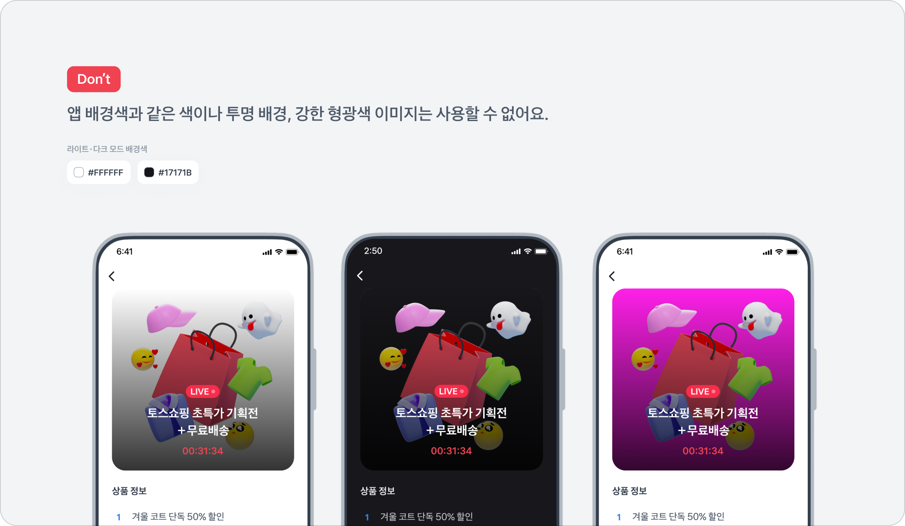

# 소재 가이드

#### 라이브 마켓 소재 설정 가이드

<figure><figcaption></figcaption></figure>

* 소재 공통 가이드에 따라 타이틀 및 상품 정보에 **평어체(반말)**&#xC744; 사용할 수 없어요.
* 랜딩 페이지에서 확인 불가한 혜택,정보는  광고 소재에 기재할 수 없어요.
  * 반드시 랜딩 URL(이벤트 페이지)에서 확인 가능한 정보로 광고 소재를 구성해주세요.
* 소재 검수 시간은 **평일 10:00 \~ 19:00**이며, 모든 소재는 순차적으로 검수되고 있어요.
  * 원활한 광고 운영을 위해서 집행일 기준 **2-3영업일 전** 소재를 제출해 주세요.


- 방송 시작 일시는 1일 단위로 선택 가능하고 방송 시작 당일 소재 제출 시 광고 집행 가능 여부를 확정할 수 없어요.
  * 광고 효율을 위해 2-3 영업일 전 소재를 제출해주세요.
- 심사 승인 이후에도 광고 집행 일시가 지나지 않았다면 소재 수정 후 재심사 요청할 수 있어요.
  * **심사 중**이거나 **집행 중** 또는 **집행완료** 상태인 경우 <mark style="color:red;">소재 수정 불가</mark>


***

* 각 영역의 문구는 반드시 서로 **연결되지 않는 문장**으로 구성해 주세요.
  * 연결된 문장은 심사 반려될 수 있어요.



- &#x20;**상품 이미지**
  * **1000\*1000 사이즈** jpg,jpeg,png 이미지
- **이미지 색상 가이드**
  * 투명 배경, 강한 형광색, **토스의 배경 색상과 같은 컬러**의 배경 이미지는 사용할 수 없어요.

<figure><figcaption></figcaption></figure>

\
**아래와 같은 이미지를 사용하는 경우 심사 반려될 수 있어요.**

* **이미지 내에 텍스트를 기재하는 경우**&#x20;
  * 브랜드명과 로고 삽입이 필요한 경우 우측 상단 영역에 추가해주세요.
    * 상품명, 기획전 정보는 사용할 수 없어요.
* &#x20;**라이브 방송과 연관성이 없거나 브랜드 로고 이미지를 사용하는 경우**
  * 판매 제품 또는 혜택  > <mark style="color:blue;">**O**</mark>
  * 브랜드 로고만 노출된이미지> <mark style="color:red;">**X**</mark>
* **테두리가 있거나 작게 분할되어 3개 이상 복잡한 오브젝트로 구성된 경우**
  * 2할 분할컷 이미지를 사용하는 경우 주요 사물 식별이 가능하다면 승인
* **이미지 내에 충분한 여백 없이 전체 비중을 차지하는 경우**
  * 광고 집행 시 이미지 잘림이 발생할 수 있어 최소 20% 이상 여백을 두고 이미지 구성해주세요.
    * 단색 배경 외 상품 이미지, 텍스트, 꾸밈 요소, 배경 패턴 등은 여백으로 판단하지 않아요.
* &#x20;**주요 제품이 가운데에 배치되어 있지 않고 좌/우에 배치되어 가독성이 낮은 경우**&#x20;
  * 주요 제품을 강조하기 위해 최대한 가운데에 배치하여 구성해주세요.

<figure><figcaption></figcaption></figure>



* [x] 타이틀은 2줄로 구성되어 있고 브랜드,상품과 혜택을 명확하게 알 수 있도록 입력해주세요.

- **라이브 마켓 이벤트 타이틀**&#x20;
  * 공백 포함 최대 10자 입력 가능해요.
  * 맞춤법에 어긋나는 표현 혹은 신조어는 포함되지 않아야해요.
  * 이벤트 메인 타이틀에는 **브랜드/상품/기획전명**만 입력 가능해요.
- 특수 문자를 반복 사용하거나 과도한 강조나 과장 표현으로 오해 될 수 있는 경우 사용을 제한하고 있어요.
- 유저에게 조급함 또는 불안감을 줄 수 있는 문구는 사용할 수 없어요.
  * <mark style="color:orange;">사용 불가 예시)</mark> 소량 확보, 전량 소진, 품절 임박&#x20;
- 수치를 알 수 없는 추상적 표현과 허위광고 및 과대 광고 문구/ 비속어 및 혐오성 표현은 사용 불가해요.
- 이벤트 서브 타이틀에는 **가격 혜택의 내용을 기재하는 것을 권장해요.**
  *   2줄로 구성된 이벤트 타이틀 영역 문장은 이어지는 문장이 아닌 각각의 혜택 정보를 기재해주세요.

      *   <mark style="color:orange;">사용 불가 예시)</mark>

          이벤트 메인 타이틀 : 토스에서 가장 인기있는

      &#x20;      이벤트 서브 타이틀 : 반 치킨 할인&#x20;



* [x] 라이브 마켓에서 판매하는 상품 또는 라이브 혜택에 대한 설명을 기재하는 영역이예요.

- &#x20;**상품 정보**
  * 공백 포함 최대 18자 입력 가능해요.
  * 최소 2개 최대 3개까지 입력할 수 있어요.
  * 1\~3번 상품 정보는 중복되지 않아야 해요.
    * 광고 효율을 위해 각각 다른 혜택 또는 정보를 기재해주세요.
- 유저에게 조급함 또는 불안감을 줄 수 있는 문구는 사용할 수 없어요.
  * <mark style="color:orange;">사용 불가 예시)</mark> 소량 확보, 전량 소진, 품절 임박&#x20;
- 수치를 알 수 없는 추상적 표현과 허위광고 및 과대 광고 문구/ 비속어 및 혐오성 표현은 사용 불가해요.



* [x] **방송 URL 오기입 시 발생되는 불이익에 대해서는 토스에서 보상하지 않아요. 광고 생성 시 문제 없이 사용 가능한 URL이 맞는지 반드시 확인해주세요.**
* [x] **방송 라이브 혜택을 증빙할 수 있는 랜딩 페이지 구성이 불가한 경우 첨부의견을 통해 방송 혜택을 확인할 수 있는 증빙 자료를 제출해주세요. ( 랜딩 시안,목업 및 방송 스케줄 정보 등)**&#x20;

- [**유저가 접속할 때 이상이 없어야 해요**](https://toss-ads.gitbook.io/guide/policy/creativeguide#id-5)**.**
  * 앱으로 랜딩된다면, 앱 미설치 유저는 앱 스토어 / 구글 플레이스토어로 랜딩될 수 있어야 해요.
  * 앱을 설치한 유저는 앱 안으로 연결되어야 해요.
  * 랜딩 과정에서 접속하는데 5초 이상 걸리는 경우, 브릿지 페이지를 만들어 주세요.
  * 모든 랜딩 페이지는 반드시 모바일 전용 웹/앱 페이지로 구성되어야 해요.
- [**랜딩/이벤트 페이지의 내용과 소재 내용이 일치해야 해요**](https://toss-ads.gitbook.io/guide/policy/creativeguide#id-6)**.**
  * 랜딩 / 이벤트 페이지에서 확인할 수 없는 혜택, 정보는 광고 승인이 불가해요.
  * 광고의 정보를 바로 제공하지 않고 제약 조건(**로그인 혹은 회원가입**) 선행되는 랜딩페이지는 사용이 불가해요.
  * 랜딩 페이지 수정이 어렵다면, 팝업이나 고정된 배너를 활용하여 광고 소재에 기재한 혜택 정보를 기재해 주세요.
  * 랜딩 페이지 내에는 접속한 유저가 상품/이벤트/프로모션에 대해 문의할 수 있는 문의처가 기재되어 있어야 해요.
- 랜딩 페이지로 이동한 후 노출되는 상품 정보는 **해당 상품이 등록된 플랫폼의 정책**에 따라 제한되거나 변경될 수 있어요.
- 토스와 공식적으로 제휴하거나 사전 협의가 이루어진 광고가 아닌 경우 랜딩 페이지 내에 **토스의 브랜드명 또는** **서비스명**을 사용할 수 없어요.
  * 내부 협의가 완료된 경우 증빙 자료를 제출해주세요.
- [**URL 주소는 반드시 영문으로 제출해주셔야 해요**](https://toss-ads.gitbook.io/guide/policy/creativeguide#id-4)**.**
  * 주소에 한글이 있는 경우 오류가 발생할 수 있어요.
  * 링크 내에 { } ^ # 문구가 있으면 반려될 수 있어요.
    * ^ 대신 \_(언더바)를 사용해주세요.
  * http:// 는 사용이 불가하여 https:// 를 사용해주세요.
  * 숏링크/단축 URL 형태는 사용할 수 없어요. (비틀리 포함)
    * 앱스플라이어로 생성한 원링크 기입 시에도 축약형 숏링크가 아닌 원본 롱링크를 기입 해주세요.
- 이외의 사유로 CTA 링크에 이슈가 있다고 판단되는 경우, 링크 수정 안내 드릴 수 있어요.
  * 그 외 공통으로 적용되는 규정은 [소재 심사 규정](https://toss-ads.gitbook.io/guide/policy/creativeguide#id-4) 을 참고해주세요.



