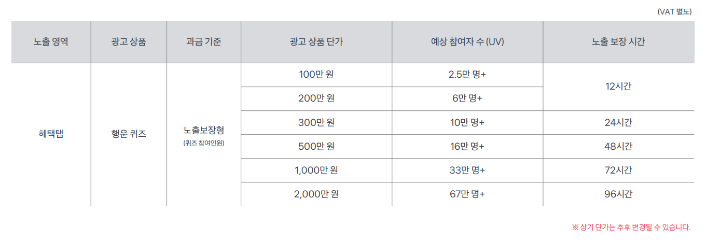

# 행운퀴즈

> 행운퀴즈는 혜택탭 전체 유저 대상 노출을 통해 광고주 페이지로 폭발적인 트래픽 확보 및 브랜딩에 효과적인 상품이에요.

***

## 광고 생성하기

<figure><figcaption></figcaption></figure>



#### 광고 생성을 위해 각 항목에 맞는 정보를 입력해주세요

✔**광고 시작 일시**: 집행 일시는 날짜와 시간까지 설정할 수 있어요.

✔ **비용**: 비용은 최소 100만원 \~ 최대 2,000만원 중 선택할 수 있어요.

* 선택한 비용에 따라 광고 노출 시간과 퀴즈 예상 참여자 수가 달라져요.
  *   상세한 사항은 아래 이미지를 참고해주세요.

      
<figure><figcaption></figcaption></figure>




#### 약관 동의 확인 및 체크

<figure><figcaption></figcaption></figure>

✔ 광고 집행 시 필수적으로 확인 필요한 **위약금 정책** 및 **운영, 정산 관련** 내용을 안내하고 있어요. 광고를 생성 하기 전 반드시 확인하고 동의 여부를 체크해주세요.




* 행운퀴즈는 논타겟 상품으로, 만 19세 이상 성인 타겟 설정 필요한 광고는 집행이 어려워요.
  * 예시 )  전자 담배, 주류, 청소년 관람불가 영상물 등
* 행운퀴즈의 경우 실시간 동시 접속이 분 당 15만명 이상 발생할 수 있어요.\
  위 사항을 고려하여랜딩 URL을 단기간에 많은 트래픽 접속이 가능한 페이지로 설정해주세요.

