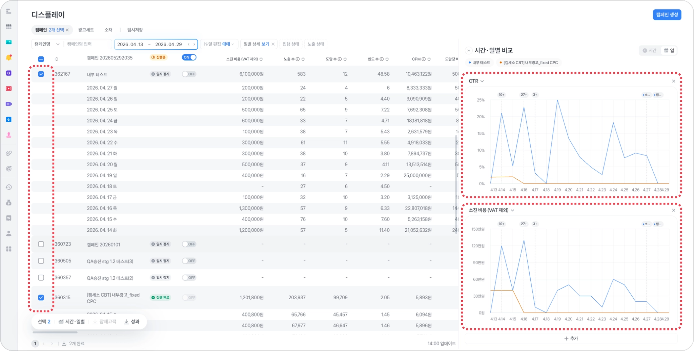

# 성과 보기

디스플레이 광고 성과 대시보드에서 캠페인·광고 세트·소재를 운영하고 주요 지표를 확인하는 방법을 안내해요. 분석 기준과 지표를 직접 조합해 데이터를 비교하려면 [맞춤 보고서로 보는 광고 성과](../reports/report.md)를 확인해 주세요.

## 1. 성과 조회 

### 기본 성과 조회

대시보드에서 배너 광고 캠페인/세트/소재 단위로 광고 집행 기간 동안의 성과를 확인할 수 있어요.

* 조회 기간은 기본으로 ‘오늘’ 하루로 선택되어 있고, 변경할 수 있어요.
* **성과 데이터는 1시간 단위**로 업데이트돼요.

<figure><figcaption></figcaption></figure>

* **열 편집 > 내 설정**에서 내가 보고 싶은 열만 골라서 직접 설정하거나, 지표별・전환 목표별로 제공되는 추천 설정을 사용할 수 있어요.

<figure><figcaption></figcaption></figure>

그 외 대시보드 기능이 궁금하다면 [대시보드 유용한 기능](performance.md#id-5)을 확인해 주세요.

### 일별 성과 조회

* **일별 상세** 버튼을 누르면 캠페인 광고 집행 기간의 성과를 일별로 확인할 수 있어요.
* 일별 성과는 최대 30일까지 조회할 수 있어요.

<figure><figcaption></figcaption></figure>

### 시간대별 성과 조회

* 최근 30일의 시간대별 노출 수, 클릭 수, 도달 수, 재생 수 등의 성과 데이터를 볼 수 있어요.
* 선택한 캠페인 수나 데이터 양이 많으면 다운로드에 실패할 수 있어요. 이때는 선택 범위를 줄여 다시 시도해 주세요.

<figure><figcaption></figcaption></figure>

***

## 2. 성과 다운로드

성과 다운로드는 캠페인 집행이 시작되고 1시간 이후부터 가능해요.

### 단일 성과 다운로드

캠페인/세트/소재 각각의 탭에서 성과를 엑셀 파일로 다운로드할 수 있어요.

* 경로: 배너 성과 탭 → **\[다운로드]** 버튼 → **\[성과]** 버튼

<figure><figcaption></figcaption></figure>

### 일괄 성과 다운로드

여러 개의 캠페인/세트/소재를 선택한 후 하단 **\[성과]** 버튼을 누르면 여러 성과를 한 번에 다운로드할 수 있어요.

<figure><figcaption></figcaption></figure>


**성과 다운로드 내역 조회**

배너 성과 대시보드 하단의 성과 다운로드 팝업에서 최근 7일 동안 다운로드한 내역을 볼 수 있어요. 다운로드 내역은 7일 이후 자동으로 삭제되고 따로 저장되지 않아요.


<figure><figcaption></figcaption></figure>

### 잠재고객 다운로드 

잠재고객 모으기로 수집된 리드는 캠페인 목록에서 바로 다운로드할 수 있어요.

* **잠재고객 수가 1건 이상 있어야 \[잠재고객]** 버튼이 활성화돼요.

<figure><figcaption></figcaption></figure>

* 여러 캠페인을 선택하고 하단 **\[잠재고객]** 버튼을 누르면 원하는 캠페인의 잠재고객 데이터를 한 번에 다운로드할 수 있어요.

<figure><figcaption></figcaption></figure>

***

## 3. 성과 시간·일별 비교

시간별 또는 일별로 원하는 캠페인/세트/소재의 성과 추이를 그래프로 볼 수 있어요. 대시보드에서 제공하는 모든 성과 지표를 비교할 수 있어요.

* 소진 비용, CPC, CPM, CTR, 노출 수, 클릭 수, 도달 수, 도달당 비용, 빈도 수
* 잠재고객 모으기, 앱 설치, 회원가입, 장바구니 담기, 구매의 전환 수, 전환당 비용, 전환율 등
  * 예: 잠재고객 수, 잠재고객 제출당 비용, 잠재고객 제출률
* 비교 데이터는 **시간대별/일별 단위**로 구분해 볼 수 있어요.
  * 시간대별: 최대 7일 이내
  * 일별: 최대 92일 이내

### 두 개 지표끼리 비교

하나의 캠페인을 선택한 후 **시간・일별** 버튼을 누르면 오른쪽에서 x축과 y축에 각각 원하는 성과 지표를 설정해 비교할 수 있어요.

* 광고 세트와 소재 탭에서도 같은 방법으로 비교할 수 있어요.

<figure><figcaption></figcaption></figure>

### 여러 캠페인끼리 비교

여러 캠페인을 선택한 후 **시간・일별** 버튼을 누르면 한 성과 지표에 대해 여러 캠페인을 비교할 수 있어요.

* 성과 지표를 추가하면 여러 그래프가 추가돼요.
* 광고 세트와 소재 탭에서도 같은 방법으로 비교할 수 있어요.

<figure><figcaption></figcaption></figure>

***

## 4. 노출 ON/OFF 

### 단일 ON/OFF

* 캠페인, 광고 세트, 소재의 노출을 각각 켜거나 끌 수 있어요.

<figure><figcaption></figcaption></figure>

### 일괄 ON/OFF

* 여러 광고 세트나 소재의 노출을 한 번에 켜거나 끌 수 있어요.

<figure><figcaption></figcaption></figure>

### 노출 예약

* 광고 세트나 소재를 일괄 ON/OFF 할 때 문제가 있어 바로 켤 수 없는 항목도 ‘노출 예약’으로 처리돼요.
* 노출 예약을 켜면 문제 해결 후 노출이 켜져요. 노출 예약을 끄면 문제를 해결한 뒤에도 노출이 켜지지 않아요.

<figure><figcaption></figcaption></figure>

***

## 5. 대시보드 유용한 기능

### 정보 수정 

* 상세 페이지로 이동하지 않아도 대시보드에서 아래 정보를 바로 수정할 수 있어요.
  * 캠페인
    * 캠페인명
    * 총 예산
    * 집행 기간
    * 소진 방법(일반/빠른)
  * 광고 세트
    * 광고 세트명
    * 입찰 금액
    * 노출 기간
    * 노출 시간대(요일별 설정 제외)
  * 소재
    * 소재명

<figure><figcaption></figcaption></figure>

### 열 편집

* 대시보드는 기본으로 모든 열을 보여줘요.
* **\[열 편집]** 버튼을 눌러 확인할 열의 순서와 구성을 바꿀 수 있어요.

<figure><figcaption></figcaption></figure>

#### 내 설정

<figure><figcaption></figcaption></figure>

1. **\[+ 추가]** 버튼을 누르면 나만 볼 수 있는 열 구성을 추가할 수 있어요.
2. 왼쪽에서 구성할 열을 선택해요.
3. 오른쪽에서 손잡이를 위아래로 끌어 순서를 바꿔요.
4. 전체 선택을 해제해 처음부터 다시 선택하거나, **\[x]** 버튼을 눌러 개별 항목만 선택 해제할 수 있어요.

### 열 너비 조정

* 대시보드 각 열의 너비를 자유롭게 조절할 수 있어요.
  * 변경한 너비는 따로 저장하지 않아도 새로 고침하거나 페이지를 나간 뒤에도 유지돼요.

<figure><figcaption></figcaption></figure>

### 오름차순/내림차순 정렬

* 각 열의 오른쪽 화살표 버튼을 눌러 정렬할 수 있어요.

<figure><figcaption></figcaption></figure>

### 임시저장 캠페인 조회 

* 임시 저장한 캠페인은 배너 광고 대시보드 상단 **\[임시저장]** 탭에서 확인할 수 있어요.

<figure><figcaption></figcaption></figure>
