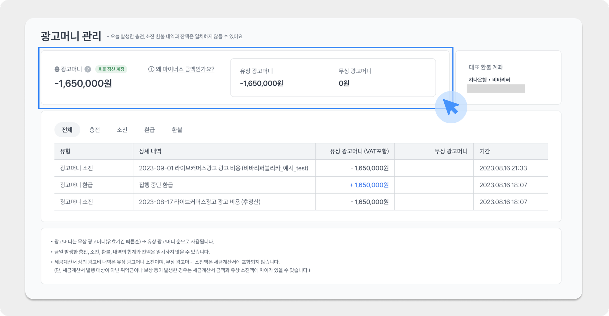
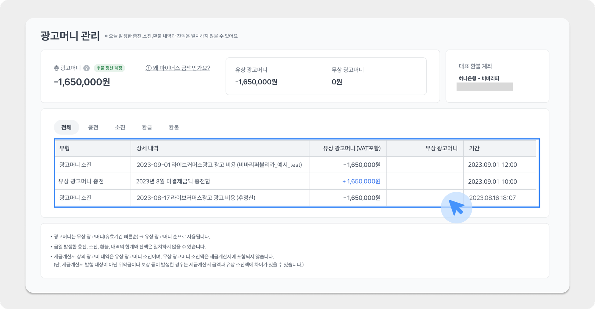

---
layout:
  width: default
  title:
    visible: true
  description:
    visible: false
  tableOfContents:
    visible: true
  outline:
    visible: true
  pagination:
    visible: true
  metadata:
    visible: false
  tags:
    visible: true
---

# 후불 계정의 정산

### 후불 계정

후불 계정은 광고를 선 집행한 뒤에 익월 초에 후정산하는 형태의 광고계정을 의미해요.&#x20;

**토스와 별도 협의를 거친 계정이 후불 계정으로 설정**되며, 후불 집행 가능 한도는 토스 내부 검토 결과에 따라 달라질 수 있어요.

### 광고 머니

<figure><figcaption></figcaption></figure>

* 광고머니는 토스 애즈에서 광고 집행 시 발생되는 광고비를 결제하는 데 사용되는 머니예요.
* 광고머니에는 유상머니와 무상머니가 있으며, 만료일 기한이 가까운 무상머니부터 자동으로 우선 사용돼요.

#### 유상머니

* 후불 계정의 경우, 집행 전에 별도로 유상머니를 충전하지 않고 매월 1일 \~ 말일까지 실제 광고 집행으로 인해 사용된 금액에 대해서 익월 초 세금계산서를 발행하여 후불로 정산을 진행해요.

#### 무상머니

* 토스에서 프로모션, 이벤트 진행 등으로 인해 지급한 무상 광고머니를 의미해요.
* 무상머니는 지급 시 설정된 만료일까지만 사용이 가능하며, 만료 기한이 지나면 자동으로 소멸돼요.
* 무상머니는 특정 캠페인에만 선택하여 사용하실 수 없으며, 만료 기한이 가까운 무상머니가 자동으로 우선 사용돼요.

<figure><figcaption></figcaption></figure>

* 후불 정산 계정의 경우, 별도 유상머니 충전 없이 후불 한도 내에서 광고를 먼저 집행하고 집행된 유상머니 금액에 대해서 익월 초에 일괄 정산하게 돼요.
* 따라서 총 광고머니 혹은 유상 광고머니가 마이너스 금액으로 노출되더라도 광고가 집행 중단되지 않으며 지속해서 소진하신 금액만큼 마이너스 차감이 이루어져요.

### 후불 계정의 정산(입금) 처리

* 집행일 기준 익월 초 (5일) 에 정산 금액 확정 및 세금계산서 발행이 진행돼요.
* 세금계산서 발행과 더불어, 전월 최종 광고비 금액에 대해서 **입금 안내 메일이 발송돼요**.
*   메일 확인 후, 각 광고 계정에 **지정된 지정가상계좌로 광고비를 입금**하면, 전월의 마이너스 금액 (미결제 금액)은 모두 정산 완료 상태로 바뀌게 돼요.

    * 지정 가상계좌로 금액을 입금 완료하면, 확인 후 당일 정산 완료 처리가 진행돼요.
    * 세금계산서 발행 금액과 입금 시도 금액이 불일치할 시, 입금 처리가 실패해요.

    <figure><figcaption></figcaption></figure>
* 각 광고 계정 별 지정된 가상 계좌는 광고 계정 홈 > 대시보드 하단 **계좌보기** 버튼 클릭 후 확인하실 수 있어요.
* 가상 계좌에 대해, 가상계좌 확인서 발급 필요 시 [toss-ads@toss.im](mailto:toss-ads@toss.im) 으로 문의주세요.
* 후불 계정의 경우 세금계산서 **작성일자 기준 30일 이내** 광고비를 입금해 주셔야 해요. 3개월 이상 입금 지연 시 별도 공지 없이 광고 계정이 중단될 수 있어요. 광고 계정이 중단된 후 신규로 생성하는 계정은 선불로만 승인 가능한 점 참 고 부탁드려요.
* 선불 정산 계정 (광고 머니를 사전에 충전한 뒤, 차감하는 형태) 으로 변경하고 싶으시다면\
  [toss-ads@toss.im](mailto:toss-ads@toss.im) 으로 광고 계정 이름과 함께 사유를 보내주시면 검토 후 전환을 도와드려요.
