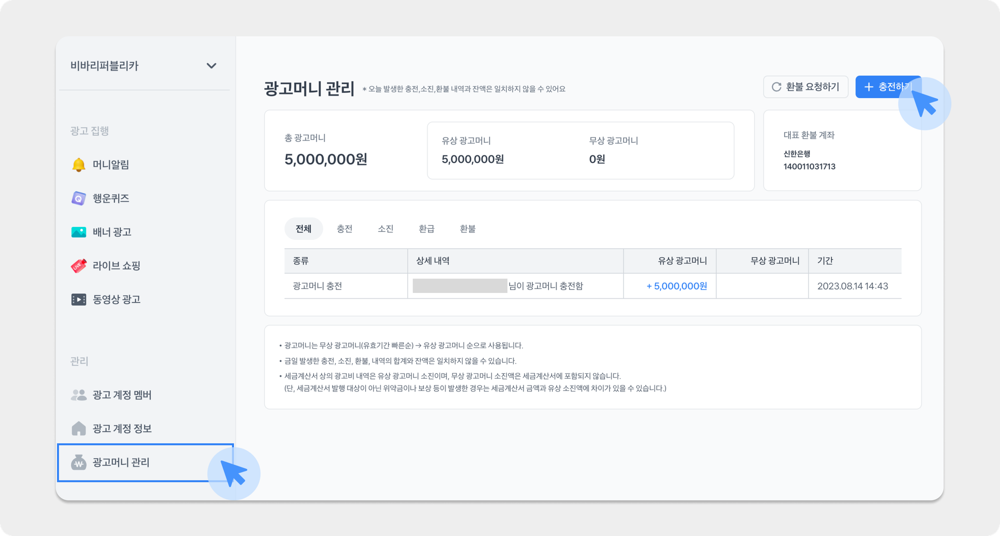
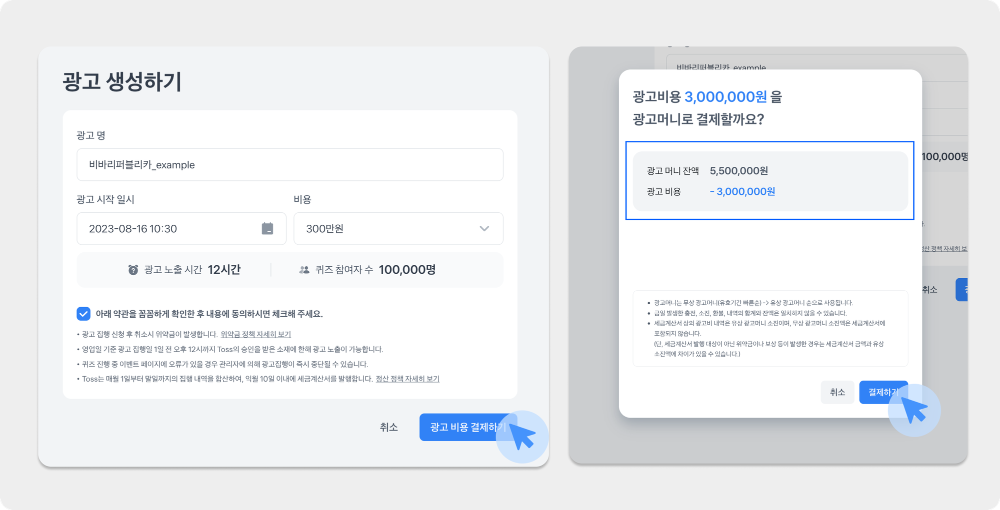
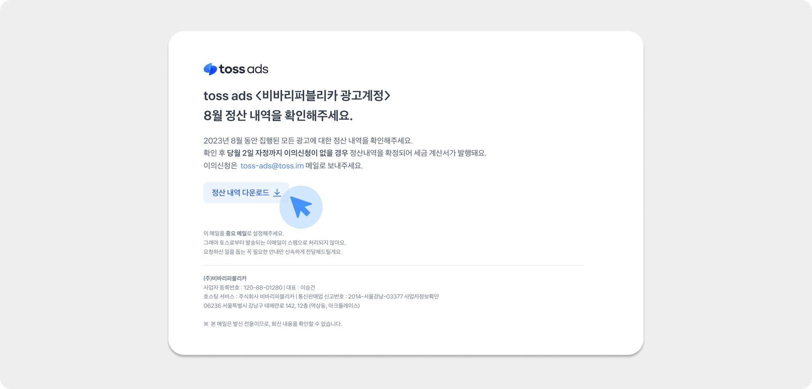

---
layout:
  width: default
  title:
    visible: true
  description:
    visible: false
  tableOfContents:
    visible: true
  outline:
    visible: true
  pagination:
    visible: true
  metadata:
    visible: false
  tags:
    visible: true
---

# 선불 계정의 정산

#### 광고머니 충전하기

<figure><figcaption></figcaption></figure>

\[광고머니 관리] 메뉴의 우측 상단 \[+충전하기] 버튼을 눌러 희망하는 금액만큼 광고머니를 충전할 수 있어요.&#x20;

충전 후 사용하지 않은 광고머니는 환불 요청할 수 있어요.

#### 광고 상품 집행 신청 시 차감

<figure><figcaption></figcaption></figure>

희망하는 광고 상품을 선택해 광고를 생성하면, 해당 상품의 단가에 따라 보유한 광고머니 잔액 내에서 결제가 진행돼요.

광고머니가 부족한 경우에는 먼저 충전한 뒤 광고를 생성해 주세요.

#### 정산 내역

<figure><figcaption></figcaption></figure>

기존에는 캠페인 단위로 정산서를 다운로드 가능했으나, 2023년 8월 집행분부터는 매월 초(2\~3일)에 광고계정 대표 이메일로 정산 내역 안내 메일을 보내드려요.

* 안내 메일에 포함된 링크를 통해 세금계산서 메뉴에 접속하면 상세 정산 내역을 확인할 수 있어요.
  * 광고계정 \[세금계산서] 메뉴에서도 직접 확인 가능해요.
