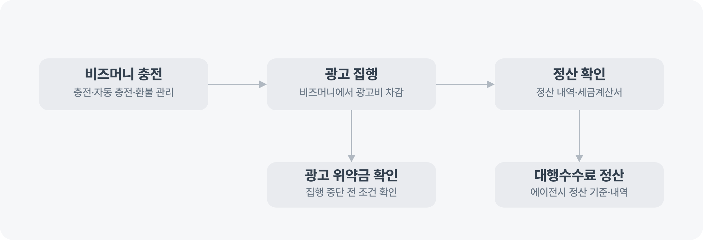

---
layout:
  width: default
  title:
    visible: true
  description:
    visible: false
  tableOfContents:
    visible: true
  outline:
    visible: true
  pagination:
    visible: true
  metadata:
    visible: true
  tags:
    visible: true
  actions:
    visible: true
---

# 광고비 결제·정산 알아보기

광고비를 충전하고 관리하거나, 광고계정과 에이전시의 정산 내역, 집행 중단 시 위약금을 확인할 수 있어요. 현재 필요한 작업에 맞는 문서를 선택해 주세요.

<figure><figcaption></figcaption></figure>

## 광고비 충전·관리하기

광고 집행에 사용할 비즈머니를 충전하거나 자동 충전과 환불 방법을 확인해요.


[ad\_money.md](ad_money.md)


## 광고계정 정산 확인하기

광고계정의 정산 내역과 세금계산서, 선불·후불 계정의 정산 문서를 확인해요.


[settlement](settlement/)


## 에이전시 대행수수료 정산하기

에이전시가 대행수수료 정산 기준과 내역을 확인해야 한다면 대행수수료 정산 문서를 확인해요.


[agency.md](settlement/agency.md)


## 집행 중단 전 위약금 확인하기

광고 집행을 중단하려면 상품별 위약금 발생 조건과 면제 기준을 먼저 확인해요.


[penaltyguide.md](penaltyguide.md)

