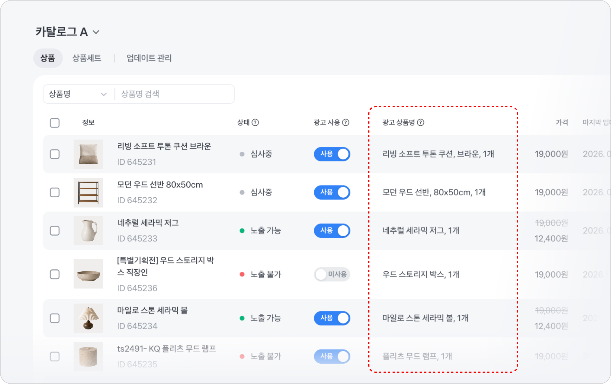
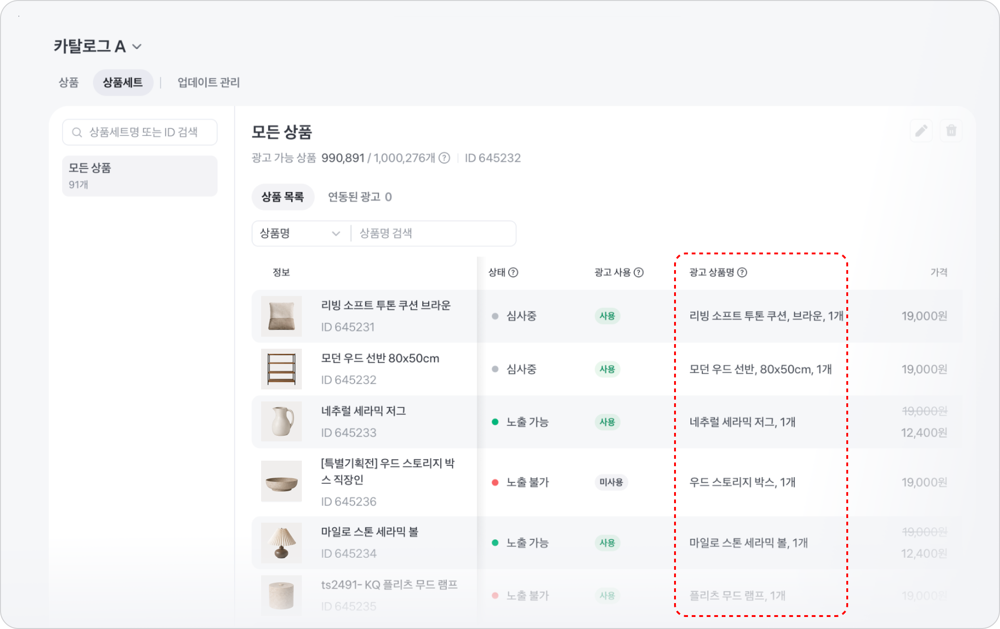
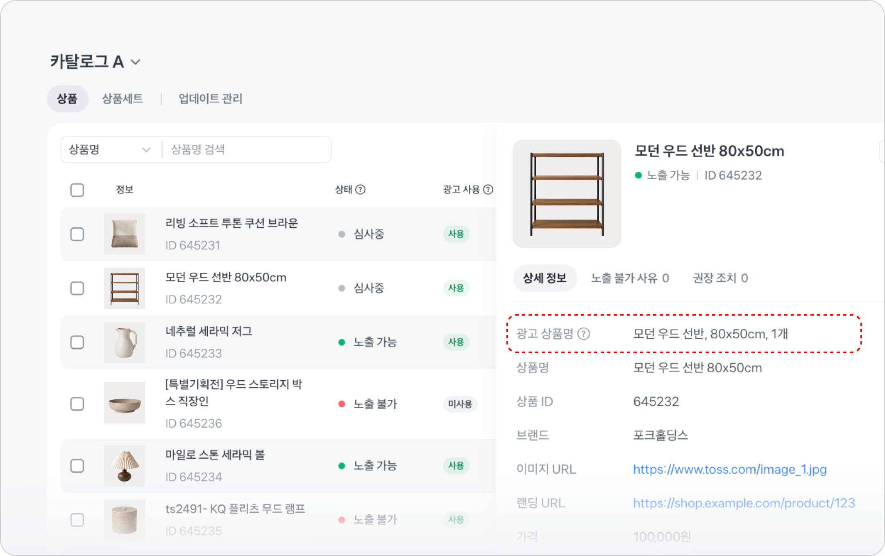

---
layout:
  width: default
  title:
    visible: true
  description:
    visible: false
  tableOfContents:
    visible: true
  outline:
    visible: true
  pagination:
    visible: true
  metadata:
    visible: true
  tags:
    visible: true
  actions:
    visible: true
---

# 카탈로그 연동 가이드

카탈로그는 광고할 상품 목록을 토스애즈에 한 번에 등록하고, 한곳에서 관리하는 도구예요. 이 문서를 따라 하면 카탈로그를 만들고, 상품을 등록해 광고에 사용할 수 있는 상태로 만들 수 있어요.

## 카탈로그란? 

상품이 많은 판매처일수록 상품마다 광고를 따로 만들고 정보를 최신으로 유지하기가 어려워요. 카탈로그에 상품 목록을 한 번 등록해두면 이렇게 편하게 사용할 수 있어요.

* 상품 수백, 수천 개를 파일 하나 또는 URL 하나로 한 번에 등록해요.
* 상품을 하나씩 수정할 필요 없이 상품 목록 URL이나 파일을 최신으로 관리하면 가격, 할인, 재고 변경 사항을 광고에 반영할 수 있어요. 자동 등록을 사용하면 이 과정도 정해진 주기에 맞춰 자동으로 진행돼요.
* 등록한 상품의 오류와 광고 노출 가능 상태를 한 화면에서 확인하고 관리해요.
* 소재를 따로 만들지 않아도 등록한 상품이 카드 형태의 광고로 자동 노출돼요.

카탈로그 연동부터 광고 집행까지는 이렇게 진행돼요.

1. 카탈로그를 만들고 상품을 등록해요.
2. 등록 결과와 상품 상태를 확인하고, 오류가 있으면 해결해요.
3. [구매 유도하기 캠페인 만들기](../a-d/purchase/)에서 카탈로그와 해당 카탈로그의 상품 세트 1개를 함께 연결해요.

## 시작하기 전 준비하기

### 필수 상품 정보 6가지를 준비해 주세요

상품마다 아래 6가지 정보가 반드시 있어야 해요. 하나라도 빠진 상품은 등록되지 않아요.

| 상품 정보   | 칼럼명           | 설명                                                                                                                              |
| ------- | ------------- | ------------------------------------------------------------------------------------------------------------------------------- |
| 상품 ID   | `id`          | 상품의 고유 ID예요. 재고 관리에 쓰는 상품 고유 번호(SKU) 사용을 권장해요. 전환 이벤트의 `product_id`와 동일한 값이어야 해요.                                               |
| 상품명     | `title`       | 광고에 노출되는 상품명이에요.                                                                                                                |
| 브랜드     | `brand`       | 상품의 브랜드명이에요.                                                                                                                    |
| 이미지 URL | `image_url`   | 상품 이미지 주소예요. 가로와 세로가 모두 500px 이상이고 JPG·JPEG·PNG 형식이어야 해요.                                                                       |
| 랜딩 URL  | `landing_url` | 광고를 선택하면 이동하는 상품 상세 페이지 주소예요. 앱 딥링크나 앱 성과 측정 도구(MMP)의 추적 URL을 사용한다면 필수 파라미터를 포함하고, 폴백 경로는 반드시 해당 상품의 웹 상품 상세 페이지(PDP)로 설정해야 해요. |
| 가격      | `price`       | 상품 가격이에요. 원화만 지원해요.                                                                                                             |


앱 딥링크의 폴백 경로가 웹 상품 상세 페이지가 아니면 심사에서 반려돼요. 앱 마켓이나 프로모션 페이지 등 다른 페이지로 연결할 수 없어요.


할인 가격, 재고, 배송 정보 같은 선택 정보까지 포함한 전체 규격과 CSV·TSV 템플릿은 [카탈로그 연동 스펙](spec.md)에서 확인해 주세요.

### 전환 및 추적 연동을 완료해 주세요

카탈로그를 활용한 구매 유도하기 캠페인은 전환 및 추적 연동이 필수예요. 광고 랜딩이 웹이라면 [웹 광고 성과 측정 연동(토스 픽셀)](../tracking/tosspixel/)을, 앱이라면 [앱 광고 성과 측정 연동(MAT)](../tracking/mat/)을 먼저 완료해 주세요.

상품별 성과를 측정하려면 카탈로그의 **상품 ID**가 전환 이벤트의 `product_id`와 같아야 하고, **랜딩 URL**에서 전환이 추적되어야 해요. 전환 연동을 완료해야 이 두 값을 정확히 맞출 수 있어요. 자세한 입력 규칙은 [카탈로그 연동 스펙](spec.md)을 참고해 주세요.

### 상품 등록 방식을 선택해 주세요

카탈로그를 만들 때 상품을 등록하는 방식은 두 가지예요.

| 방식        | 이런 경우에 좋아요                                                          | 조건                                                                                                                                              |
| --------- | ------------------------------------------------------------------- | ----------------------------------------------------------------------------------------------------------------------------------------------- |
| **자동 등록** | 
• 상품 가격, 재고가 자주 바뀌는 경우 • 상품 목록 URL을 등록하면 주기적으로 최신 정보를 가져옴
 | <ul><li><code>https://</code>로 시작하는 URL</li><li>CSV·TSV 형식, 파일 4GB 이하 (XML 등 다른 형식 미지원)</li><li>상품 500만 건 이하</li><li>UTF-8 인코딩 형식만 가능</li></ul> |
| **수동 등록** | 
• 상품 변동이 거의 없어 한 번만 등록하면 되는 경우 • CSV, TSV 파일로 직접 등록
       | <ul><li>파일 100MB 이하</li><li>상품 10만 건 이하</li><li>UTF-8 인코딩 형식만 가능</li></ul>                                                                      |

## 자동 등록으로 카탈로그 만들기

자동 등록은 상품 목록을 제공하는 URL을 토스애즈에 연결하는 방식이에요. 최초 등록 때 상품을 수집하고, 이후에는 설정한 일정에 맞춰 같은 URL에서 최신 목록을 다시 확인해요.

### 자동 등록 설정하기

<figure><figcaption></figcaption></figure>

1. 토스애즈 좌측 메뉴에서 **광고 도구 > 카탈로그**를 선택하고 **생성** 버튼을 눌러 주세요. 카탈로그는 광고계정마다 최대 5개까지 만들 수 있어요.
2.  **카탈로그명**과 **상품 판매처명**을 입력해 주세요. 상품 판매처명은 구매 유도하기 광고 지면에 그대로 표시돼요. 실제로 사용하는 판매처 이름 중 고객에게 보여 줄 이름을 선택해 주세요.

    * 선택한 이름은 띄어쓰기까지 정확히 입력해 주세요.
    * `공식`, `자사몰`, `공식 쇼핑몰`처럼 이름에 붙는 불필요한 표현은 빼는 것을 권장해요.

    | <mark style="color:blue;">**`DO`**</mark> | <mark style="color:$danger;">**`Don't`**</mark> |
    | ----------------------------------------- | ----------------------------------------------- |
    | 토스                                        | 토스 공식 쇼핑몰                                       |
3. 상품 등록 방식에서 **자동 등록**을 선택해 주세요.
4. **상품 목록 URL**을 입력해 주세요.
5. **업데이트 주기**를 선택하고 **생성** 버튼을 눌러 주세요.

### 상품 목록 URL이란?

상품 데이터베이스 파일이 호스팅되는 URL이에요. 다른 광고 플랫폼에서 사용하던 피드 URL을 그대로 연결할 수는 없어요. 카탈로그 연동 스펙에 맞게 작성한 파일을 호스팅한 URL을 준비해 주세요. 상품 목록 URL은 아래 조건을 충족해야 해요.

* `https://`로 시작하는 유효한 URL이어야 해요.
* URL에 연결된 상품 데이터 파일은 CSV 또는 TSV 형식이어야 해요. XML 등 다른 형식은 지원하지 않아요.
* URL에 연결된 파일은 4GB 이하이고 상품은 500만 건 이하여야 해요.
* 필수 상품 정보 6가지 칼럼이 모두 있어야 해요. 하나라도 없으면 연동에 실패해요.
* 업데이트할 때마다 같은 URL에서 최신 파일을 받을 수 있어야 해요.

### 업데이트 주기

자동 등록은 설정한 주기에 맞춰 상품 목록 URL에서 최신 정보를 가져와요.

* **업데이트 주기**
* 매일 또는 매주 중에 선택하고, 시각을 지정할 수 있어요.
* 기본값은 매일 오전 9시예요.

업데이트할 때마다 상품 목록 URL의 최신 파일을 기준으로 카탈로그가 맞춰져요. 새 상품은 추가되고, 정보가 바뀐 상품은 수정되고, 최신 파일에 없는 상품은 삭제돼요.


💡 **자동 등록을 사용하면 최초 등록이 즉시 진행돼요.** 이후 등록은 설정한 시간에 맞춰 주기적으로 진행돼요. 최초 등록이 오래 걸려 다음 등록 예정 시간을 지난 경우에는, 최초 등록이 끝난 뒤 한 번 더 업데이트가 진행돼요.


정해진 주기를 기다리지 않고 바로 반영하고 싶다면, **업데이트 관리** 탭 상단의 **업데이트** 버튼으로 즉시 업데이트할 수 있어요. 즉시 업데이트는 3시간에 한 번만 가능해요. 정기 업데이트가 실패하면 마지막으로 성공한 상품 목록을 광고에 계속 사용해요. 기존 광고가 바로 중단되지는 않지만, 실패한 업데이트에 담긴 가격·재고 변경은 반영되지 않아요. **업데이트 관리**에서 문제 보고서를 내려받아 오류를 확인하고 해결해 주세요.

### 연결 상태 확인하기

자동 등록 카탈로그는 화면 상단에서 상품 목록 URL의 연결 상태를 보여줘요.

| **상태** | **의미**                                                                |
| ------ | --------------------------------------------------------------------- |
| 정상 연결  | 상품 목록 URL에서 상품을 정상적으로 가져오고 있어요.                                       |
| 업데이트 중 | 상품 목록을 가져오는 중이에요. 완료 전까지는 이전 상품 목록이 보여요.                              |
| 연결 오류  | 상품 목록 URL에 접근할 수 없어요. URL 주소 또는 파일 상태를 확인한 뒤 **다시 시도** 버튼으로 재연결해 주세요. |

## 수동 등록으로 카탈로그 만들기

수동 등록은 준비한 파일을 한 번 등록하는 방식이에요. 원본 상품 정보가 바뀌어도 자동으로 갱신되지 않으므로 가격, 재고 또는 판매 상태가 달라지면 새 파일을 다시 등록해야 해요.

### 수동 등록 설정하기

<figure><figcaption></figcaption></figure>

1. [자동 등록과 동일하게](how-to.md#undefined-4) 카탈로그 생성 화면에서 카탈로그명과 상품 판매처명을 입력한 후, 상품 등록 방식에서 **수동 등록**을 선택해 주세요.
2. 상품 정보를 담은 CSV 또는 TSV 파일을 등록해 주세요. 파일은 100MB 이하이고 상품은 10만 건 이하여야 해요.
3. **생성** 버튼을 눌러 주세요.

카탈로그 연동 스펙에 첨부된 CSV 또는 TSV 템플릿을 사용해 주세요. 템플릿의 첫 행에는 영문 칼럼명(`id`, `title`, `brand` 등)이 입력되어 있어요. 영문 컬럼명을 수정하거나 삭제하지 마세요. 수동 등록한 상품 정보를 바꾸려면 **업데이트 관리** 탭의 **정보 수정** 버튼을 선택해 새 파일을 등록해 주세요.

## 등록 결과 확인하기

<figure><figcaption></figcaption></figure>

자동 등록과 수동 등록 모두 **\[생성]** 버튼을 누르면 상품 등록이 시작돼요. 창을 닫아도 등록은 백그라운드에서 계속되고, 완료되면 이메일로 알려드려요. 상품 수가 많으면 등록에 시간이 걸릴 수 있어요.

등록 결과는 카탈로그의 **업데이트 관리** 탭에서 확인해요. 최초 등록부터 이후의 자동·수동 업데이트까지 모든 기록이 남고, 건마다 완료 일시, 전체 상품 수와 함께 두 가지 상태 중 하나가 표시돼요. 문제 보고서와 전체 내역은 90일 동안 보관돼요.

<table><thead><tr><th width="85.83984375">상태</th><th>의미</th><th>다음 행동</th></tr></thead><tbody><tr><td>성공</td><td>모든 상품이 등록됐어요. 노출 불가 사유나 권장 조치가 있으면 문제 보고서가 함께 발행될 수 있어요.</td><td>상품 탭에서 광고 가능 상품이 있는지 확인하고, 문제 보고서가 발행됐다면 내용을 확인해 주세요.</td></tr><tr><td>실패</td><td>1개 이상 상품이 등록되지 않았어요. 문제 보고서가 발행돼요.</td><td>문제 보고서를 내려받아 원인을 확인하고, 원본을 수정한 뒤 다시 등록해 주세요.</td></tr></tbody></table>

상품 목록 URL에 접근할 수 없는 등의 이유로 카탈로그 연동 자체가 실패하면 실패 안내가 표시돼요. 이 경우 카탈로그 문제 해결하기를 참고해 주세요.

## 광고에 사용할 수 있는 상품 확인하기

<figure><figcaption></figcaption></figure>

광고에 사용되는 상품은 **광고 가능 상품**, 즉 **노출 가능** 상태이면서 **광고 사용 여부**가 **사용**으로 설정된 상품이에요. 상품 탭 상단의 광고 가능 상품 필터를 누르면 지금 광고에 나갈 수 있는 상품만 모아서 볼 수 있어요.

**상태**는 상품 정보 오류와 심사 결과에 따라 정해져요. 상품 탭에서 상품별로 확인할 수 있어요.

<table><thead><tr><th width="125.57421875">상태</th><th>의미</th></tr></thead><tbody><tr><td>노출 가능</td><td>광고에 노출할 수 있는 상태예요. 오류나 심사 반려가 없는 정상 상태예요.</td></tr><tr><td>노출 불가</td><td>오류나 심사 반려로 광고에 노출할 수 없어요. 재고 없음, 판매 중단 상품도 노출되지 않아요.</td></tr></tbody></table>

**광고 사용 여부**는 광고주가 직접 선택해요. 특정 상품을 광고에서 빼고 싶다면 광고 사용 여부 토글을 **미사용**으로 바꿔 주세요. 여러 상품을 선택해서 한 번에 바꿀 수도 있어요.

<table><thead><tr><th width="125.57421875">상태</th><th>의미</th></tr></thead><tbody><tr><td>사용</td><td>광고에 사용해요.</td></tr><tr><td>미사용</td><td>광고에 사용하지 않아요.</td></tr></tbody></table>


**상품을 빼고 싶을 때는 삭제보다 미사용을 권장해요.**

자동 등록을 사용 중이라면, 상품을 삭제해도 다음 자동 업데이트 때 상품 목록 URL에 해당 상품 ID가 남아 있으면 다시 등록될 수 있어요. 미사용으로 설정하면 자동 업데이트와 관계없이 광고에 노출되지 않아요.


## AI로 최적화된 광고 상품명 확인하기

AI 상품명 최적화는 원본 상품명을 최대한 유지하면서 광고에 노출할 상품명을 정규화하는 기능이에요. 브랜드명을 중복 없이 상품명 맨 앞에 배치하고 쉼표 같은 표기 방식을 통일해, 이용자가 여러 상품의 핵심 정보를 쉽게 비교할 수 있어요.

카탈로그를 등록하면 최적화된 이름은 원본 **상품명**과 구분해 **광고 상품명**으로 표시돼요.

### 상품 목록에서 확인하기

**상품** 탭의 **광고 상품명** 칼럼에서 최적화된 이름을 확인할 수 있어요.

**상품세트** 탭의 **광고 상품명** 칼럼에서도 최적화된 이름을 확인할 수 있어요.

### 상품 상세 패널에서 확인하기

상품을 선택해 상세 패널을 열면 **광고 상품명** 리스트에서 최적화된 이름을 확인할 수 있어요.


**구매 유도하기 캠페인에는 AI 상품명 최적화가 기본으로 적용돼요.**

구매 유도하기 캠페인에서는 AI 상품명 최적화 기능을 해제할 수 없어요. 특정 상품의 **광고 상품명**을 사용하기 어렵다면 해당 상품의 **광고 사용 여부**를 **미사용**으로 바꿔 주세요. 그러면 해당 상품은 구매 유도하기 캠페인의 모든 광고 지면에서 노출되지 않아요.


## 카탈로그 준비 완료 확인하기

카탈로그를 만들었다고 바로 광고를 시작할 수 있는 것은 아니에요. 아래 항목이 모두 충족되면 광고를 만들 준비가 끝난 상태예요.

1. 카탈로그가 생성되고 최초 상품 등록이 완료됐어요.
2. 광고 가능(노출 가능이면서 광고 사용 여부가 사용) 상품이 1개 이상 있어요.
3. 전환 및 추적 연동이 완료됐고, 전환 이벤트의 `product_id`가 카탈로그의 상품 ID와 일치해요.

상품 목록 등록에 성공했더라도 모든 상품이 노출 불가이거나 광고 사용 여부가 미사용이면 광고에 사용할 수 없어요. 이 경우 [카탈로그 문제 해결하기](troubleshooting.md)에서 원인별 조치를 확인해 주세요.

## 다음 단계

준비가 끝났다면 [구매 유도하기 캠페인 만들기](../a-d/purchase/)에서 캠페인을 생성하고, 카탈로그와 해당 카탈로그의 상품 세트 1개를 함께 연결해 주세요.


💡 캠페인에 연결한 카탈로그는 심사 제출 이후 변경할 수 없어요. 제출 전에 카탈로그와 상품 세트를 다시 확인해 주세요.


카탈로그 운영·심사 정책에서 상품 정보 관리와 광고 제한 기준을 확인할 수 있어요.
