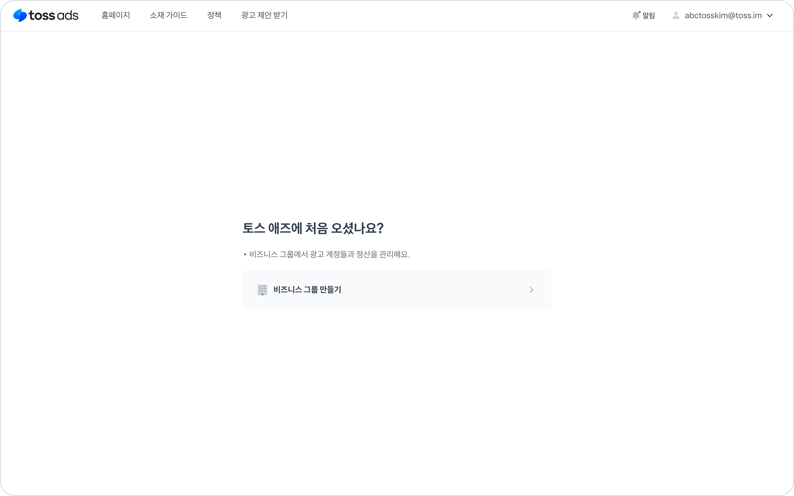
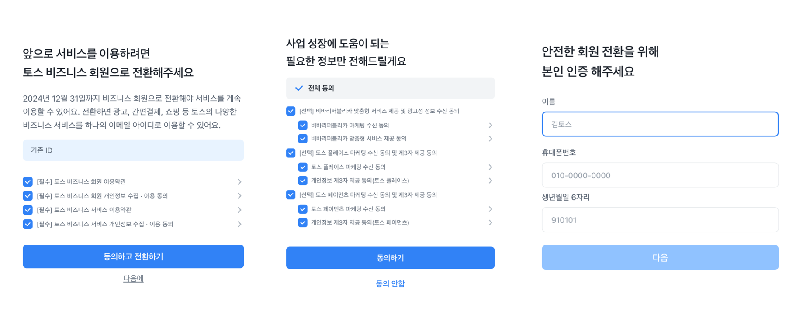

# 비즈니스 그룹 생성

비즈니스 그룹이란?

비즈니스 그룹은 toss ads에서 광고를 집행하기 위해 생성하는 사업자 단위의 개념이예요.

* **하나의 사업자 번호로 여러 개의 비즈니스 그룹을 만들 수 있어요.**
* 하나의 비즈니스 그룹은 동일한 정산 정보를 공유해요.
* 비즈니스 그룹의 그룹장이 되면, [하위 광고 계정](create-2.md#undefined)들을 생성하고 관리할 수 있어요.

<mark style="color:blue;">※ 비즈니스 그룹 생성 시 입력한 사업자 등록번호를 기준으로 광고비 정산 및 세금 계산서가 발행이 진행되므로, 비즈니스 그룹을 생성할 때는 신중히 결정해주세요.</mark>

toss ads 에서 광고를 집행하기 위한 최소 단위는 광고 계정이기 때문에, 비즈니스 그룹에만 소속되어 있고 하위 광고 계정이 없는 경우 광고를 집행할 수 없어요.

* 비즈니스 그룹을 새롭게 만들고, 하위에 광고 계정 만들기
* 기존에 존재하던 비즈니스 그룹에 초대되어, 하위에 광고 계정 만들기
* 기존에 존재하던 광고 계정에 초대 받기

**2024년 12월 23일** 이전에 생성된 기존 광고 계정은 비즈니스 그룹이 자동으로 생성돼요.

* 위 경우, 사업자 정보에 따라 비즈니스 그룹장 임명 방식이 달라져요.
  * 개인/법인 사업자 : 광고 계정의 최초 생성자가 비즈니스 그룹의 그룹장으로 임명
  * 광고 대행사 : 에이전시 대시보드 접근 권한이 있는 계정이 그룹장으로 임명
* 그룹장 권한이 필요하다면 [채널톡](http://toss-business.channel.io/)으로 문의 주세요. 경우에 따라 위임장 제출이 필요할 수 있어요.

***

## 비즈니스 그룹 생성 및 조회하기&#x20;

### 1. 비즈니스 그룹 만들기를 클릭해주세요

<figure><figcaption></figcaption></figure>

### 2. 생성할 비즈니스 그룹의 사업자 등록번호를 입력해주세요

<figure><figcaption></figcaption></figure>

* 입력한 사업자 등록번호를 기준으로 **광고비 정산** 및 **세금계산서 발행**이 진행돼요.
  * 한번 입력한 사업자 등록번호는 수정이 불가하므로, 여러 개의 비즈니스 그룹을 생성하여 운영하는 경우 정산까지 고려하여 입력해주세요.
* **휴업, 폐업** 상태의 사업자로는 비즈니스 그룹 생성이 불가해요.

### 3. 사업자 등록번호를  통해 기존에 생성된 비즈니스 그룹을 확인하거나 새로 만들기를 클릭해주세요

<figure><figcaption></figcaption></figure>

* 입력한 사업자 등록번호를 기준으로 이미 존재하는 비즈니스 그룹 목록을 확인할 수 있어요.
* 동일한 사업자 등록번호를 사용해 새로운 비즈니스 그룹 생성을 원하시는 경우 **'새로  만들기'**&#xB97C; 눌러주세요.

<figure><figcaption></figcaption></figure>

* 자사 브랜드를 직접 광고하시는 경우  "아니요"를 눌러주세요.
* [에이전시 (광고 대행사) ](create.md#undefined-3)인 경우 "네"를 눌러주세요.
  * 별도로 에이전시로 신청하지 않은 경우 에이전시 계약 체결 및 수수료 협의가 어려워요.
* 이미 가입된 사업자 정보를 가진 비즈니스 그룹의 경우 최초 가입 정보와 같은 **광고 대행 여부**가 자동으로 선택돼요.

### 4. 사업자 등록번호를 기준으로 사업자 정보를 입력해주세요&#x20;

#### 4-1. 법인사업자

* **필요 서류**
  * 사업자등록증
  * 법인 계좌 사본
  * 위임장
    * 위임장은 아래 템플릿을 활용해주세요



* **아래의 항목이 모두 일치하게 입력되었는지 확인해주세요.**
  * 사업자명
  * 대표자명
    * 공동대표인 경우 ","를 통해 구분해주세요.
      * 예) 김토스, 박토스, 이토스
  * 개업일
  * 법인 계좌번호

#### ⚠️ 광고 대행사이신가요?  

광고 대행을 목적으로 광고 계정을 생성하시고자 하시며, 대행 수수료를 지급 받고자 하실 경우 아래 내용을 확인 해주세요.



**\[토스 애즈 광고 대행]**

광고 대행으로 수수료를 지급 받으시려면, 먼저 대행 계약체결이 필요해요.\
(대행수수료는 광고대행사가 토스를 대신하여 토스 광고를 영업/운영/정산업무를 진행하며 광고주의 광고 셀프서빙함에 토스가 광고대행사에게 지급하는 금액이에요.)

대행 수수료 지급 조건인 '광고대행사'의 경우  아래의 조건에 해당해야 하며 사전 협의된 수수료가 지급돼요.

1. 토스와 사전 협의를 통해 광고 등 업무제휴계약체결이 되어 있어야 해요.
2. 대행사는 사업자등록 상 '광고대행업' 종목이 포함된 곳이어야 해요.
3. 수수료 지급 대상 광고는 광고대행사가 아닌 광고주의 광고건이어야 하며 광고주를 대신하여 광고신청/운영/정산업무를 진행하는 건이어야 해요.

위 조건에 해당하신다면, adsbiz.team@toss.im 으로 대행 계약 체결 요청 메일을 발송해주세요.



#### 3-2. 개인사업자 

* **필요 서류**
  * 사업자등록증
  * 계좌 사본
  * 위임장
    * 위임장은 아래 템플릿을 활용해주세요.



* **아래의 항목이 모두 일치하게 입력되었는지 확인해주세요.**
  * 사업자명
  * 대표자명
    * 공동대표인 경우 "," 를 통해 구분해주세요.
      * 예) 김토스, 박토스, 이토스
  * 개업일
  * 계좌번호

### 5. 비즈니스 그룹 신청이 완료되었어요

<figure><figcaption></figcaption></figure>

* 신청된 비즈니스 그룹은 영업일 기준 최대 **1-2일 이내**로 확인하고 **이메일**을 통해 승인/반려결과를 안내해드리고 있어요.

### :warning:토스 비즈니스 회원 전환

토스 비즈니스 회원이 되면 토스에서 각각 운영되던 쇼핑, 애즈 등의 서비스에  통합 ID 하나로 로그인이 가능해져요.

토스 애즈를 이용하시던 고객분들께는 토스 비즈니스 회원으로 전환에 대해 안내드리고 있어요.

<figure><figcaption></figcaption></figure>

비즈니스 회원 전환 동의 및  간단한 본인 인증을 진행하시면 전환이 완료돼요.
