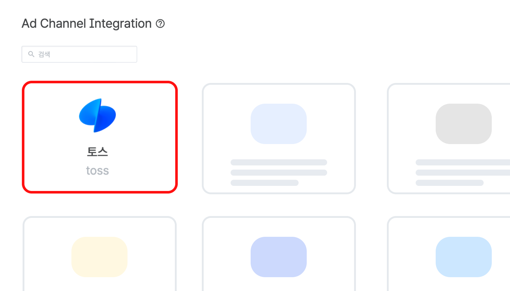

# 애드저스트

### 전환 추적 코드 생성하기&#x20;



#### 전환 및 추적 연동&#x20;

<figure><figcaption></figcaption></figure>

전환 및 추적 연동 설정은 아래 경로에서 가능해요.

광고 계정 접속 → 광고 도구 \[전환 및 추적 연동] 선택&#x20;



#### 전환 추적 코드 생성

<figure><figcaption></figcaption></figure>

전환·추적 연동 사용에 동의한 뒤\
코드명, 연동 방식, 업체를 선택해 코드를 생성해요.



#### 생성 여부 확인&#x20;

<figure><figcaption></figcaption></figure>

설정한 정보에 맞게 생성된 전환 추적 코드의 ID를 복사하여 연동할 수 있어요.



***

### 애드저스트 연동하기



#### 애드저스트 연동 경로

<figure><figcaption></figcaption></figure>

애드저스트 연동 링크 생성은 아래 경로에서 가능해요.

&#x20;Campaign Lab → Partenrs 선택&#x20;



#### 연동 앱 선택&#x20;

<figure><figcaption></figcaption></figure>

우측 상단 New Partner 버튼 선택 →  \[Toss]앱 검색



#### 링크 생성&#x20;

<figure><figcaption></figcaption></figure>

* 토스 앱 선택 후 연동 링크를 생성할 수 있어요.&#x20;
  * 상세한 가이드는 [애드저스트 트래킹 링크 생성 가이드](https://ior.ad/ado1)를 참고해주세요.&#x20;



***

### 전환 이벤트 연동하기

토스애즈에서 수집하는 전환 이벤트 항목은 아래와 같아요.&#x20;

<table><thead><tr><th width="155.86328125">이벤트 이름</th><th width="326.3515625">Toss Ads 이벤트 라벨</th><th width="499.30859375">Adjust 이벤트 라벨</th></tr></thead><tbody><tr><td>설치</td><td>INSTALL</td><td>install reinstall</td></tr><tr><td>앱 오픈</td><td>APP_OPEN</td><td>session</td></tr><tr><td>앱 딥링크 오픈</td><td>APP_DEEPLINK_OPEN</td><td>click</td></tr><tr><td>장바구니 추가</td><td>ADD_TO_CART</td><td>add to basket</td></tr></tbody></table>


* 연동 후 전환 추적을 위해서는 소재를 새롭게 세팅해야해요.&#x20;
  * 랜딩URL은 전환 추적 탬플릿으로 생성한 랜딩 URL로 입력해주세요.&#x20;


***

### 전환 추적 링크 필수/권장 항목&#x20;

토스애즈에서 애드저스트를 통해 광고 성과를 추적할 때 전환 추적에 필요한 **필수 항목**과 **권장 항목**을 올바르게 설정해야 정확한 데이터를 확인할 수 있어요.&#x20;

#### 필수 항목&#x20;

아래 항목들은 서로 짝을 지어 꼭 랜딩 URL에 들어가야 해요.&#x20;

필수 항목이 누락되는 경우 **어떤 광고에서 전환이 일어났는지 알 수 없고** **애드저스트 대시보드에서도 데이터가 정확하게 집계되지 않을 수 있어요.**

<table><thead><tr><th width="177">항목</th><th>값</th><th>설명 </th></tr></thead><tbody><tr><td>toss_click_id</td><td>{TOSS_TK_CLICK_ID}</td><td>클릭 발생 시 부여되는 고유 클릭 ID</td></tr><tr><td>toss_campaign_id</td><td>{TOSS_CID}</td><td>캠페인 ID</td></tr><tr><td>gps_adid</td><td>{GAID} or {AIFA}</td><td>유저 ADID (광고 식별자) * Android에 사용</td></tr><tr><td>idfa</td><td>{IDFA} or {AIFA}</td><td>유저의 ADID (광고 식별자) * iOS에 사용</td></tr></tbody></table>

#### 권장 항목

아래 항목들은 랜딩 URL에 넣는 것을 권장해요.

권장 항목이 빠지거나 잘못 설정되면 **소재별 전환 데이터를 정확하게 추적하기 어려워지고 애드저스트 표준 키와 맞지 않아 트래킹이 누락되거나 잘못 동작할 수 있어요.**

| 항목                 | 값                    | 설명    |
| ------------------ | -------------------- | ----- |
| toss\_creative\_id | {TOSS\_CREATIVE\_ID} | 소재 ID |
| toss\_site\_id     | {SITE\_ID}           | 매체 ID |

#### &#x20;**링크 구성 예시**

모든 <mark style="color:red;">**필수**</mark>**/**[<mark style="color:blue;">**권장**</mark>](#user-content-fn-1)[^1] 항목이 포함된 예시 링크

> https://app.adjust.com/sample?<mark style="color:red;">**toss\_click\_id={TOSS\_TK\_CLICK\_ID}\&toss\_campaign\_id={TOSS\_CID}\&gps\_adid={GAID}\&idfa={IDFA} or {AIFA}**</mark>&<mark style="color:blue;">**toss\_creative\_id={TOSS\_CREATIVE\_ID}\&toss\_site\_id={SITE\_ID}**</mark>


#### **링크 설정 Tip**

* 애드저스트 콘솔에서 제공하는 click attribution link를 그대로 쓰면 필수 항목과 권장 항목을 빠뜨리지 않을 수 있어요.
  * 자세한 설정 방법은 [애드저스트 트래킹 링크 생성 가이드](https://ior.ad/ado1)를 참고해 주세요.
* 토스애즈 가이드에 있는 표준 이벤트와 파라미터가 들어 있는 링크 템플릿을 사용하는 걸 권장해요.
* 이벤트 매핑이 잘못되면 실제 전환 데이터가 빠질 수 있으니 표준 키와 구조를 꼭 확인해 주세요.


[^1]: 
