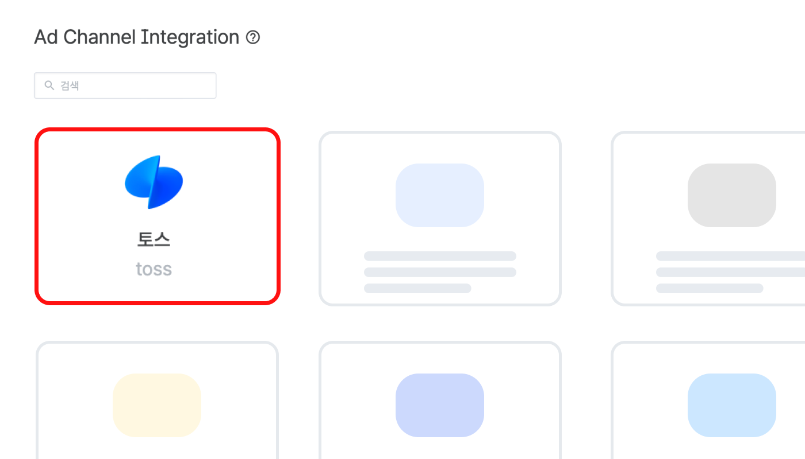

# 애드저스트

### 전환 추적 코드 생성하기



**전환 및 추적 연동**

<figure><figcaption></figcaption></figure>

전환 및 추적 연동 설정은 아래 경로에서 가능해요.

광고 계정 접속 → 광고 도구 \[전환 및 추적 연동] 선택



**전환 추적 코드 생성**

<figure><figcaption></figcaption></figure>

전환·추적 연동 사용에 동의한 뒤\
코드명, 연동 방식, 업체를 선택해 코드를 생성해요.



**생성 여부 확인**

<figure><figcaption></figcaption></figure>

설정한 정보에 맞게 생성된 전환 추적 코드의 ID를 복사하여 연동할 수 있어요.



***

### 애드저스트 연동하기



**애드저스트 연동 경로**

<figure><figcaption></figcaption></figure>

애드저스트 연동 링크 생성은 아래 경로에서 가능해요.

Campaign Lab → Partners 선택



**연동 앱 선택**

<figure><figcaption></figcaption></figure>

우측 상단 New Partner 버튼 선택 → \[Toss]앱 검색



**연동 활성화**

<figure><figcaption></figcaption></figure>

* 연동 페이지로 들어가 토스 플랫폼에서 발급받은 전환추적코드 ID를 넣어주세요.
* 전송 규칙은 Data from all attribution sources 으로 설정해주세요.
* 상세한 가이드는 [Adjust 연동 가이드](https://help.adjust.com/ko/partner-setup/toss)를 참고해주세요.



***

### 전환 이벤트 연동하기

토스애즈에서 수집하는 전환 이벤트 항목은 아래와 같아요.

<table><thead><tr><th width="178.70050048828125">이벤트 이름</th><th>Toss Ads 이벤트 라벨</th><th>Adjust 이벤트 라벨</th></tr></thead><tbody><tr><td>설치</td><td>INSTALL</td><td>install / reinstall</td></tr><tr><td>앱 오픈</td><td>APP_OPEN</td><td>session</td></tr><tr><td>회원가입</td><td>SIGNUP</td><td>Sign up / Registration</td></tr><tr><td>로그인</td><td>SIGNIN</td><td>Login</td></tr><tr><td>결제</td><td>PURCHASE</td><td>Gadget purchase / In-app purchase</td></tr><tr><td>상품 조회</td><td>PRODUCT_VIEW</td><td>View product</td></tr><tr><td>장바구니 추가</td><td>ADD_TO_CART</td><td>Add to basket</td></tr><tr><td>검색</td><td>SEARCH</td><td>Search product / Search (Travel)</td></tr><tr><td>결제 시작</td><td>INITIATE_CHECKOUT</td><td>Sale / checkout</td></tr><tr><td>위시리스트 추가</td><td>ADD_TO_WISHLIST</td><td>Add to wishlist</td></tr><tr><td>구독</td><td>SUBSCRIBE</td><td>Buy 1/3/6-month subscription</td></tr><tr><td>첫 구매</td><td>FIRST_PURCHASE</td><td>First sale</td></tr></tbody></table>


* 연동 후 전환 추적을 위해서는 소재를 새롭게 세팅해야 해요.
  * 랜딩 URL은 전환 추적 템플릿으로 생성한 랜딩 URL로 입력해 주세요.
* Adjust 이벤트 라벨은 Adjust에서 사용 중인 기본 명칭으로 기재되었어요. 자사 서비스에서 발생하는 이벤트를 기준으로 [토스애즈의 표준이벤트](https://toss-ads.gitbook.io/guide/resources/tag/tracked-events)와 가장 적절한 이벤트에 매핑해 주세요.


***

### 전환 추적 링크 필수/권장 항목

토스애즈에서 **애드저스트**를 통해 광고 성과를 추적할 때 전환 추적에 필요한 **필수 항목**과 **권장 항목**을 올바르게 설정해야 정확한 데이터를 확인할 수 있어요.

#### 필수 항목

아래 항목들은 서로 짝을 지어 꼭 랜딩 URL에 포함해 주세요.&#x20;

필수 항목이 누락되면 **어떤 광고에서 전환이 발생했는지 확인하기 어렵고 애드저스트 대시보드에서도 데이터가 정확하게 집계되지 않을 수 있어요.**

| 항목                 | 값                     | 설명                    |
| ------------------ | --------------------- | --------------------- |
| toss\_click\_id    | {TOSS\_TK\_CLICK\_ID} | 클릭 발생 시 부여되는 고유 클릭 ID |
| idfa / gps\_adid   | {IDFA} / {AIFA}       | 디바이스 광고 ID            |
| toss\_campaign\_id | {TOSS\_CID}           | 캠페인 ID                |

#### 권장 항목

아래 항목들은 랜딩 URL에 넣는 것을 권장해요.

권장 항목이 빠지거나 잘못 설정되면 **캠페인/광고그룹/소재 단위 성과를 세부적으로 확인하기 어렵고 애드저스트 표준 키와 맞지 않아 트래킹이 누락되거나 잘못 동작할 수 있어요.**

| 항목                 | 값                    | 설명     |
| ------------------ | -------------------- | ------ |
| toss\_creative\_id | {TOSS\_CREATIVE\_ID} | 소재 ID  |
| toss\_site\_id     | {SITE\_ID}           | 매체 ID  |
| campaign           | {CAMPAIGN\_NAME}     | 캠페인명   |
| adgroup            | {ADGROUP\_NAME}      | 광고 그룹명 |

#### **링크 구성 예시**

모든 <mark style="color:red;">**필수**</mark>**/**<mark style="color:blue;">**권장**</mark> 항목이 포함된 예시 링크

> https://app.adjust.com/abc?<mark style="color:red;">**toss\_click\_id={TOSS\_TK\_CLICK\_ID}\&idfa={IDFA}\&gps\_adid={AIFA}\&toss\_campaign\_id={TOSS\_CID}**</mark>&<mark style="color:blue;">**toss\_creative\_id={TOSS\_CREATIVE\_ID}\&toss\_site\_id={SITE\_ID}\&campaign={CAMPAIGN\_NAME}\&adgroup={ADGROUP\_NAME}**</mark>


**링크 설정 Tip**

* 애드저스트 콘솔에서 제공하는 click attribution link를 그대로 활용하면 필수/권장 항목을 놓치지 않을 수 있어요.
  * 자세한 설정 방법은 [애드저스트 트래킹 링크 생성 가이드](https://ior.ad/ado1)를 참고해 주세요.
* 이벤트 매핑이 잘못되면 실제 전환 데이터가 빠질 수 있으니 필수 항목의 구조를 꼭 확인해 주세요.
* Tracking URL에서 수정이 필요한 항목은 캠페인 설정 시 **소재 URL** 섹션에서 다시 확인할 수 있습니다.

