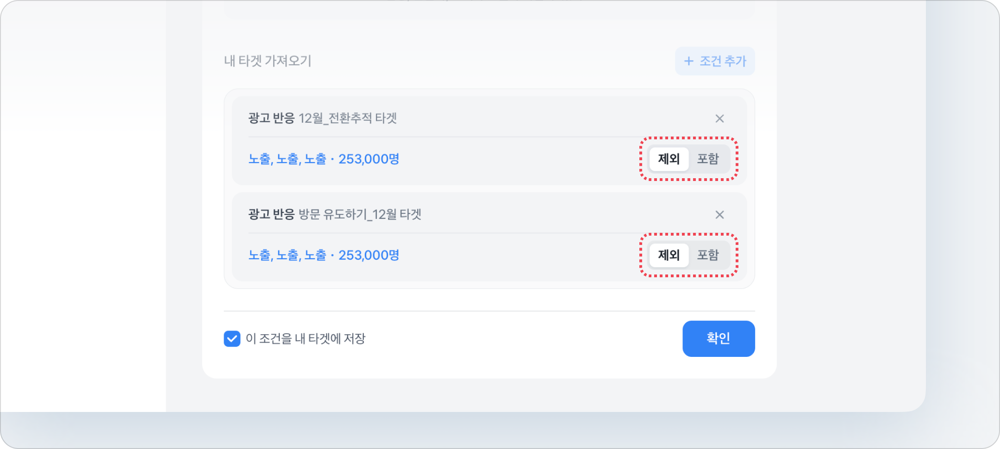

# 광고 반응 타겟

### 1. 광고반응 타겟

* **\[배너광고],  \[머니알림(일반,라이브형)]** 광고 상품은 집행했던 캠페인을 바탕으로 광고반응 타겟(리타겟)을 설정할 수 있어요.

### 설정 방법



### **광고 반응 타겟 추가**

<figure><figcaption></figcaption></figure>

&#x20;광고 반응 타겟 설정은 아래 경로에서 가능해요.

타겟 탭  →  상단\[+추가] 버튼 클릭 → \[광고 반응] 선택&#x20;



### **광고 반응 타겟 설정**

<figure><figcaption></figcaption></figure>

* 집행했던 **광고 유형**을 선택해주세요.
* **캠페인명** 혹은 **광고 세트명**을 입력하여 선택해주세요.
  * <mark style="color:blue;">\[배너 광고]는 집행 중이거나 종료일 기준 최근 3개월 이내만 선택할 수 있어요.</mark>
  * <mark style="color:blue;">그 외의 광고는 시작일 기준 최근 3개월 이내만 선택할 수 있어요.</mark>

<figure><figcaption>
타겟 추가 완료 화면
</figcaption></figure>



### **광고세트에서 가져오기**

<figure><figcaption></figcaption></figure>

<figure><figcaption></figcaption></figure>



### 광고 반응 타겟 제외/포함 설정

<figure><figcaption></figcaption></figure>

* 해당 광고들에 반응한 타겟을 제외 또는 포함 시킬 수 있어요.



### 2. 광고 반응 타겟의 결합 (교집합 / 합집합)

* 광고반응 타겟들끼리의 조합은 교집합이에요.
* 즉, 아래에서 3개 캠페인에 대해 광고반응 타겟을 설정했다면, 3개 캠페인에 모두 반응한 타겟들만 설정돼요.

<figure><figcaption></figcaption></figure>

* 또한, 아래에서 2개의 캠페인에 대해 각각 '<kbd>포함</kbd>'과 '<kbd>포함</kbd>'을 했다면, 2개 캠페인에 모두 반응한 광고 타겟이 설정돼요. (교집합)

<figure><figcaption></figcaption></figure>

### 3. 광고 상품별 반응 타겟 조건&#x20;

<table><thead><tr><th width="138.78515625">광고 상품 유형</th><th width="234.9140625">사용 가능한 조건</th><th>조건 설명</th></tr></thead><tbody><tr><td>배너 광고</td><td>배너에 노출된 유저</td><td>선택한 광고 세트의 하위 소재를 본 적이 있는 유저 (최근 3개월 이내)</td></tr><tr><td></td><td>배너를 누른 유저</td><td>선택한 광고 세트의 하위 소재를 클릭한 유저 (최근 3개월 이내)</td></tr><tr><td>신용점수 보드</td><td>신용점수 보드를 본 유저</td><td>해당 캠페인의 소재를 본 유저</td></tr><tr><td></td><td>버튼을 누른 유저</td><td>해당 캠페인의 소재에서 CTA를 클릭한 유저</td></tr><tr><td>머니 알림</td><td>머니알림 광고 페이지를 본 유저</td><td>머니 알림을 오픈해서, 광고 소재 페이지를 본 유저</td></tr><tr><td></td><td>페이지에서 버튼을 누른 유저</td><td>광고 소재 페이지 내에서 하단 CTA를 클릭한 유저</td></tr><tr><td>행운퀴즈</td><td>퀴즈 페이지를 본 유저</td><td>행운퀴즈 페이지를 진입해서 퀴즈를 본 유저</td></tr><tr><td></td><td>퀴즈를 푼 유저</td><td>퀴즈를 풀고, 리워드까지 수령한 유저</td></tr><tr><td>라이브 마켓</td><td>방송 안내 페이지를 본 유저</td><td>라이브 마켓 상세 페이지를 본 유저</td></tr><tr><td></td><td>버튼을 눌러 방송을 재생한 유저 </td><td>라이브 마켓 상세 페이지에서 방송을 재생한 유저 </td></tr><tr><td>숏폼</td><td>숏폼 안내 페이지를 본 유저</td><td>숏폼 상세 페이지를 본 유저</td></tr><tr><td></td><td>숏폼을 재생한 유저</td><td>숏폼 영상을 재생하여 시청한 유저</td></tr><tr><td>버튼 누르기</td><td>안내 페이지를 본 유저</td><td>버튼 누르기 메뉴에 진입하여 상세 페이지를 본 유저</td></tr><tr><td></td><td>버튼을 누른 유저</td><td>하단 CTA를 클릭한 유저</td></tr><tr><td>두근두근 1등 찍기</td><td>투표 페이지를 본 유저</td><td>투표를 진행할 수 있는 상세 페이지를 본 유저</td></tr><tr><td></td><td>투표에 참여한 유저</td><td>투표에 참여한 유저</td></tr></tbody></table>

