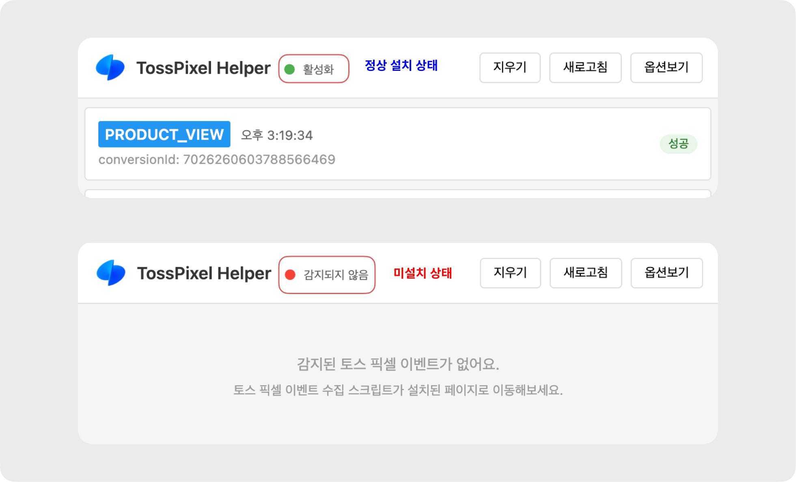

# 픽셀 이벤트 수집 확인하기

## 픽셀 헬퍼로 확인하기&#x20;

### 1. 토스 픽셀 헬퍼란?&#x20;

* 토스 픽셀 헬퍼는 웹사이트에 설치된 토스 픽셀이 제대로 작동 하는지 확인할 수 있는 크롬 확장 프로그램이에요Chrome, Edge 와 같은 브라우저에 추가하여 사용해주세요
* 토스 픽셀이 설치된 웹사이트를 자동으로 감지해요&#x20;
* 방문, 장바구니 담기, 구매 등 웹사이트에 설치한 주요 이벤트 수집 여부 실시간 확인할 수 있어요&#x20;

***

### 2. 설치 방법&#x20;


설치 가이드는 Chrome 브라우저 기준으로 작성되었어요


1. [설치 링크 바로가기](https://chromewebstore.google.com/detail/kbbggbgnfmbpjpaieklnbbjfkjkkpcbi?utm_source=item-share-cb)
2. **\[Chrome에 추가]** 버튼 클릭 → **\[확장 프로그램 추가]** 버튼 클릭&#x20;

<figure><figcaption></figcaption></figure>

3.  설치 및 프로그램 추가 이후 열리는 **TossPixel** **Helper 설정** 페이지에서 하단 **\[모든 URL 권한 요청]** 버튼을 눌러 권한 허용&#x20;

    <figure><figcaption></figcaption></figure>

    * 설치 이후 TossPixel Helper 설정 페이지가 열리지 않는다면 아래 경로에서 설정 페이지에 접근할 수 있어요
      * [x] 경로: Chrome 브라우저 우측 상단 → TossPixel Helper 아이콘 클릭 → \[옵션보기] 버튼 클릭&#x20;

<figure><figcaption></figcaption></figure>

4. 토스 픽셀 이벤트 수집 활성화 항목 활성화 여부 확인&#x20;

* 활성화 ON 기본 값으로 설정되지만 OFF되어 있다면 활성화 해야해요

<figure><figcaption></figcaption></figure>

5. 모든 설치 완료 이후 Chrome 브라우저 우측 상단 **\[확장 프로그램]** 버튼을 눌러 TossPixel Helper 고정 값으로 설정

<figure><figcaption></figcaption></figure>

***

### 3. 활용 방법&#x20;

1. TossPixel Helper을 설치한 웹사이트 접속
2. 브라우저 우측 상단 TossPixel Helpe 아이콘 클릭

<figure><figcaption></figcaption></figure>

3. 토스 픽셀 정상 설치 여부 확인&#x20;

<figure><figcaption>
설치 여부 및 이벤트 목록 노출 예시
</figcaption></figure>

4. 정상 설치가 완료 페이지인 경우 설치된 이벤트 (방문,구매 등)가 목록으로 노출되어 확인 가능&#x20;
5. 이벤트 정상 발송 여부 , 추가 파라미터 ( 금액, ID 등) 정상 전달 여부 확인 가능&#x20;

<figure><figcaption></figcaption></figure>

***

## 수동으로 확인하기&#x20;

### 1.  브라우저에서 개발자 도구 열기

* Windows: ctrl + shift + i
* Mac: cmd + opt + i

### 2. 스크립트 추가가 됐는지 확인하기

* filter 입력창(파란색 박스)에 ‘toss’ 검색 후 엔터

<figure><figcaption></figcaption></figure>

### 3. 이벤트 수집이 됐는지 확인하기

* 개발자도구 내 \[Network] 탭 (초록색 박스) 클릭
* filter 입력창(파란색 박스) 에 `https://lex.toss.im/api/lex/event` 입력
  * `lex.toss.im`, `lex`, `toss` 등으로 짧게 검색 할 수도 있어요
* 해당 화면에서 의도한 데이터가 정상적으로 네트워크를 통해 전송되었는지 확인 (노란색 박스)
  * `eventType: “PRODUCT_VIEW”` - 상품 상세 페이지 방문 이벤트가 수집됨을 확인
  * `price`, `product_id`, `product_name` 등: 의도한 파라미터들이 제대로 입력되어서 수집됨을 확인

<figure><figcaption></figcaption></figure>
