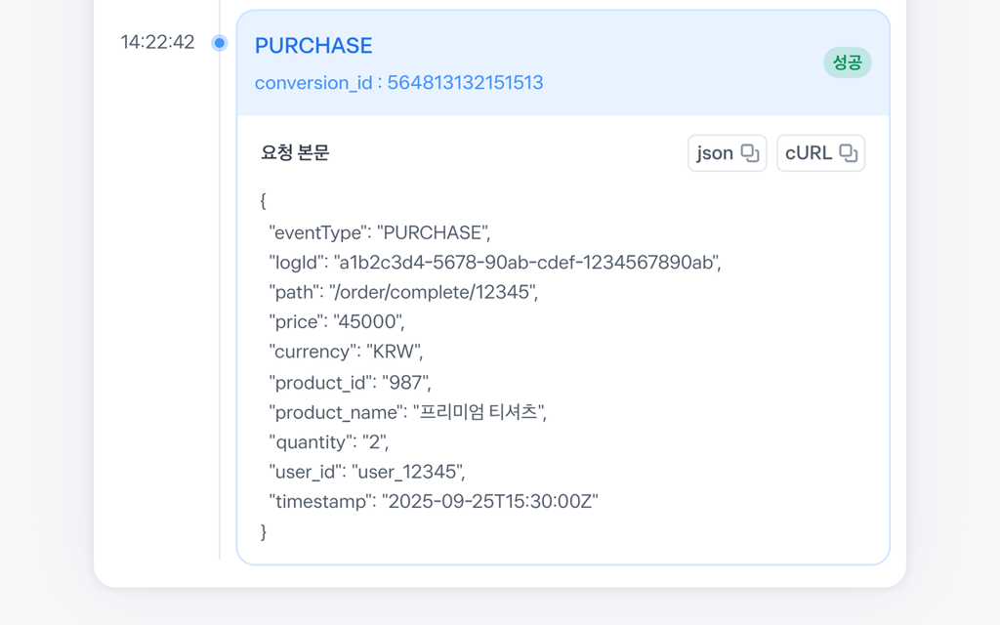

# 자사몰 픽셀 연동


&#x20;아래 가이드는 직접 구축한 자사몰에 토스 픽셀을 설치하는 방법을 안내해요.

&#x20;[카페24](24.md), [메이크샵](makeshop.md) 등 쇼핑몰 솔루션을 사용 중이라면 플랫폼별 설치 가이드를 참고해 주세요.

***

## 토스 픽셀 설치하기

토스 픽셀을 설치하려면 전환 코드가 필요해요.

전환 코드는 토스애즈 대시보드에서 발급할 수 있고, 광고계정마다 고유하게 부여돼요.

전환 코드 발급 방법은 [전환 코드 발급](../tag/code_generation.md) 가이드를 참고해 주세요.



#### SDK 스크립트 설치

모든 페이지에 공통으로 적용되는 레이아웃 파일의 \<head>태그 안에 아래 스크립트를 추가해 주세요.


```javascript
<head>
    <!-- 기존 태그들 -->
    <script src="https://static.toss.im/lex/v1.js"></script>
</head>
```


* SDK 스크립트는 사이트 전체에서 한 번만 로딩하면 돼요. 각 이벤트 코드마다 다시 넣을 필요는 없어요.
* SDK 스크립트에는 async 또는 defer 속성을 사용하지 마세요. 이벤트 코드보다 먼저 로딩되어야 해요.
* SDK 로딩에 실패하더라도 쇼핑몰의 기본 동작에는 영향을 주지 않아요.



#### 이벤트 코드 삽입

전환이 발생하는 지점에 아래 이벤트 코드를 추가해 주세요.

토스 픽셀이 지원하는 이벤트는 다음과 같아요.

| 이벤트      | 메서드명          | 삽입 위치           |
| -------- | ------------- | --------------- |
| 페이지 방문   | pageView()    | 모든 페이지          |
| 회원가입     | signUp()      | 회원가입 완료 페이지     |
| 상품 상세 조회 | productView() | 상품 상세 페이지       |
| 장바구니 담기  | addToCart()   | 장바구니 추가 버튼 클릭 시 |
| 구매       | purchase()    | 구매 완료 페이지       |
| 리드 수집    | lead()        | 리드 제출 완료 시점     |
| 커스텀 이벤트  | custom()      | 자유롭게 정의         |


모든 이벤트의 파라미터는 선택사항이에요.

파라미터 없이 메서드만 호출해도 정상 수집돼요.

다만, 파라미터를 함께 전달하면 광고 성과를 더 정확하게 분석할 수 있어요.




***

#### 페이지 방문 (pageView)

* 사용자가 접속하는 모든 페이지에 공통으로 추가해 주세요.


```html
<script>
    TossPixel('전환 코드').pageView();
</script>
```


***

#### 회원가입 (signUp)

* 회원가입 완료 페이지에 추가해주세요.


```html
<script>
    TossPixel('전환 코드').signUp();
</script>
```


***

#### 상품 상세 조회 (productView)

* 상품 상세 페이지에 추가해주세요.


```html
<script>
    TossPixel('전환 코드').productView({
        product_id: "P12345",
        product_name: "오가닉 코튼 티셔츠",
        category_id: "C100",
        category_name: "상의",
        price: 39000,
        currency: "KRW"
    });
</script>
```


**파라미터**

| 파라미터           | 타입     | 설명             | 예시           |
| -------------- | ------ | -------------- | ------------ |
| product\_id    | string | 상품 고유 ID       | "P12345"     |
| product\_name  | string | 상품명            | "오가닉 코튼 티셔츠" |
| category\_id   | string | 상품 카테고리 ID     | "C100"       |
| category\_name | string | 상품 카테고리명       | "상의"         |
| price          | number | 상품 가격          | 39000        |
| currency       | string | ISO 4217 통화 코드 | "KRW"        |

***

#### 장바구니 담기 (addToCart)

* 장바구니 추가 버튼을 클릭할 때 동적으로 호출해 주세요.


```html
<script>
    TossPixel('전환 코드').addToCart({
        revenue: 78000,
        currency: "KRW",
        total_quantity: 2,
        products: [
            {
                product_id: "P12345",
                category_id: "C100",
                category_name: "상의",
                price: 39000,
                quantity: 2
            }
            // 상품이 여러 개인 경우 같은 형식으로 추가
        ]
    });
</script>
```


**파라미터**

| 파라미터            | 타입     | 설명             | 예시    |
| --------------- | ------ | -------------- | ----- |
| revenue         | number | 전체 상품 가격 합계    | 78000 |
| currency        | string | ISO 4217 통화 코드 | "KRW" |
| total\_quantity | number | 전체 상품 수량       | 2     |
| products        | array  | 상품 목록 (아래 참조)  | —     |

**products 배열 내 항목**

| 파라미터           | 타입     | 설명         | 예시       |
| -------------- | ------ | ---------- | -------- |
| product\_id    | string | 상품 고유 ID   | "P12345" |
| category\_id   | string | 상품 카테고리 ID | "C100"   |
| category\_name | string | 상품 카테고리명   | "상의"     |
| price          | number | 개별 상품 가격   | 39000    |
| quantity       | number | 개별 상품 수량   | 2        |

***

#### 구매 (purchase)

* 구매 완료 페이지에 추가해 주세요.


```html
<script>
    TossPixel('전환 코드').purchase({
        total_price: 78000,
        currency: "KRW",
        total_quantity: 2,
        products: [
            {
                product_id: "P12345",
                category_id: "C100",
                category_name: "상의",
                price: 39000,
                quantity: 2
            }
            // 상품이 여러 개인 경우 같은 형식으로 추가
        ]
    });
</script>
```


**파라미터**

| 파라미터            | 타입     | 설명                        | 예시    |
| --------------- | ------ | ------------------------- | ----- |
| total\_price    | number | 전체 결제 금액                  | 78000 |
| currency        | string | ISO 4217 통화 코드            | "KRW" |
| total\_quantity | number | 전체 상품 수량                  | 2     |
| products        | array  | 상품 목록 (addToCart와 동일한 구조) | —     |


중복 호출 주의&#x20;

*   구매 완료 페이지에서 사용자가 새로고침하면 purchase 이벤트가 중복 전송될 수 있어요.

    주문 ID 등을 활용해 동일한 이벤트가 두 번 이상 전송되지 않도록 처리해 주세요.


***

#### 리드 수집 (lead)

* 상담 신청, 보험료 조회 등 리드 제출이 완료된 시점에 동적으로 호출해 주세요.


```html
<script>
    TossPixel('전환 코드').lead({
        lead_type: "Consultation"
    });
</script>
```


**파라미터**

| 파라미터       | 타입     | 설명              |
| ---------- | ------ | --------------- |
| lead\_type | string | 리드 유형 (아래 표 참조) |

**lead\_type**&#x20;

* lead\_type 원하는 문자열을 자유롭게 입력할 수 있어요. 아래는 업종별 권장 값이에요.

| 리드 유형   | 권장 값         |
| ------- | ------------ |
| 이벤트 참여  | Event        |
| 상담 신청   | Consultation |
| 시승 신청   | TestDrive    |
| 무료체험 신청 | FreeTrial    |
| 사전예약    | Preorder     |
| 보험료 조회  | QuoteCheck   |
| 대출한도 조회 | LoanCheck    |

***

#### 커스텀 이벤트 (custom)

* 표준 이벤트에 해당하지 않는 전환을 추적할 때 사용해요.
* 이벤트 이름은 직접 지정할 수 있고, 표준 이벤트와 같은 파라미터를 사용할 수 있어요.


```html
<script>
    TossPixel('전환 코드').custom('BUTTON_CLICK', {
        product_id: "P12345",
        product_name: "오가닉 코튼 티셔츠",
        category_id: "C100",
        price: 39000,
        currency: "KRW"
    });
</script>
```


**파라미터**

| 파라미터                | 타입     | 필수 | 설명                                           |
| ------------------- | ------ | -- | -------------------------------------------- |
| eventName (첫 번째 인자) | string | 필수 | 이벤트 이름 (예: "BUTTON\_CLICK", "WISHLIST\_ADD") |
| params (두 번째 인자)    | object | 선택 | 이벤트에 포함할 추가 데이터                              |

* 두 번째 인자에는 product\_id, price, currency 등 표준 이벤트에서 사용하는 파라미터를 전달할 수 있어요.
* 추적하려는 전환에 맞는 값을 선택해 포함해 주세요.


**표준 이벤트와의 차이**

* 표준 이벤트는 메서드명이 곧 이벤트 이름이에요.&#x20;
* 커스텀 이벤트는 첫 번째 인자에 이벤트 이름을 직접 입력해요&#x20;
  * **그 외 파라미터 사용 방식은 동일해요.**


***

#### 커스텀 프로퍼티

* 모든 이벤트(표준 이벤트, 커스텀 이벤트)에 custom\_param\_1 \~ custom\_param\_5를 추가할 수 있어요.
* product\_id, price 같은 표준 파라미터로 표현하기 어려운 추가 정보를 전달할 때 사용해요.
  * 예를 들어, 캠페인 구분값, 프로모션 코드, A/B 테스트 그룹, 유입 경로 등 필요에 따라 정의한 값을 담을 수 있어요.

```html
<!-- 표준 이벤트에 커스텀 프로퍼티 추가 -->
<script>
    TossPixel('전환 코드').purchase({
        total_price: 78000,
        currency: "KRW",
        custom_param_1: "summer_sale",
        custom_param_2: "landing_A"
    });
</script>

<!-- 커스텀 이벤트에 커스텀 프로퍼티 추가 -->
<script>
    new TossPixel('전환 코드').custom('BUTTON_CLICK', {
        product_id: "P12345",
        custom_param_1: "cta_top",
        custom_param_2: "variant_B"
    });
</script>
```

* 커스텀 프로퍼티는 최대 5개까지 사용할 수 있고, 표준 파라미터와 함께 하나의 객체로 전달해 주세요.

| 프로퍼티             | 타입     | 설명         |
| ---------------- | ------ | ---------- |
| custom\_param\_1 | string | 커스텀 프로퍼티 1 |
| custom\_param\_2 | string | 커스텀 프로퍼티 2 |
| custom\_param\_3 | string | 커스텀 프로퍼티 3 |
| custom\_param\_4 | string | 커스텀 프로퍼티 4 |
| custom\_param\_5 | string | 커스텀 프로퍼티 5 |

***

#### SPA(Single Page Application) 환경

*   React, Next.js, Vue 등 SPA 프레임워크를 사용하는 경우,페이지 이동 시 HTML이 새로 로딩되지 않아요.

    따라서 라우트가 변경되는 시점에 이벤트를 직접 호출해 주세요.

- [x] React 예시


```javascript
import { useEffect } from 'react';
import { useLocation } from 'react-router-dom';

function usePageView() {
    const location = useLocation();

    useEffect(() => {
        TossPixel('전환 코드').pageView();
    }, [location.pathname]);
}
```


* TossPixel 객체는 1단계에서 추가한 SDK 스크립트(v1.js)가 window에 등록해요. SPA 환경에서도 SDK 스크립트는 index.html의 \<head>에 한 번만 추가하면 돼요.

***

## 설치 확인&#x20;

토스 픽셀이 정상적으로 설치되었는지 아래 방법으로 확인할 수 있어요.

1. Toss Pixel Helper 크롬 확장프로그램

[Toss Pixel Helper](https://chromewebstore.google.com/detail/toss-pixel-helper/kbbggbgnfmbpjpaieklnbbjfkjkkpcbi?hl=ko\&gl=US\&pli=1)를 설치하면, 현재 페이지에서 수집된 토스 픽셀 이벤트를 실시간으로 확인할 수 있어요.

<figure><figcaption></figcaption></figure>

2. 브라우저 개발자 도구
   1. 크롬에서 개발자 도구(F12)를 열고 Network 탭을 선택해요.
   2. 페이지에서 전환 이벤트를 발생시켜요.
   3. 토스 픽셀 수집 서버로 요청이 전송되는지 확인해요.

***

## 자주 묻는 질문&#x20;

**Q. SDK 스크립트 로딩이 실패하면 쇼핑몰에 영향이 있나요?**

A. 영향은 없어요. SDK 로딩이 실패하면 TossPixel 호출만 무시되고, 쇼핑몰의 정상 동작에는 영향을 주지 않아요.


**Q. 구매 완료 페이지에서 새로고침하면 이벤트가 중복 전송되나요?**

A. 중복 전송될 수 있어요. 주문 완료 여부를 서버에서 한 번 더 확인하거나, 주문 ID 기준으로 중복 호출을 막는 처리가 필요해요.


**Q. 파라미터를 보내지 않아도 되나요?**

A. 가능해요. 모든 파라미터는 선택사항이에요. 메서드만 호출해도 정상 수집돼요.

다만, 파라미터를 함께 전달하면 광고 성과를 더 정확하게 분석할 수 있어요.
