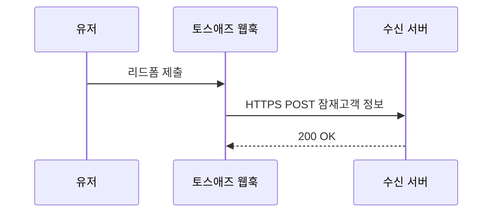
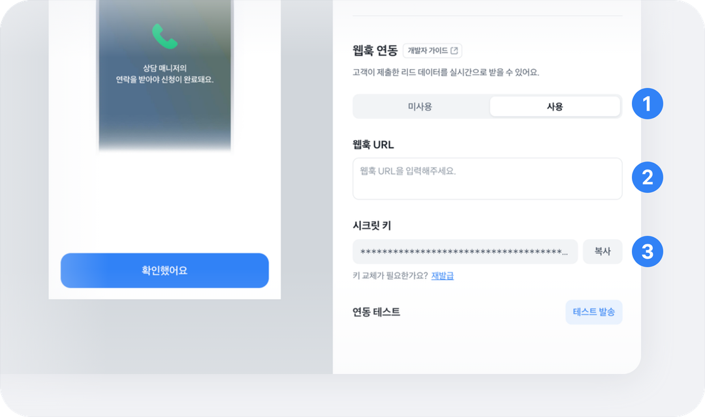
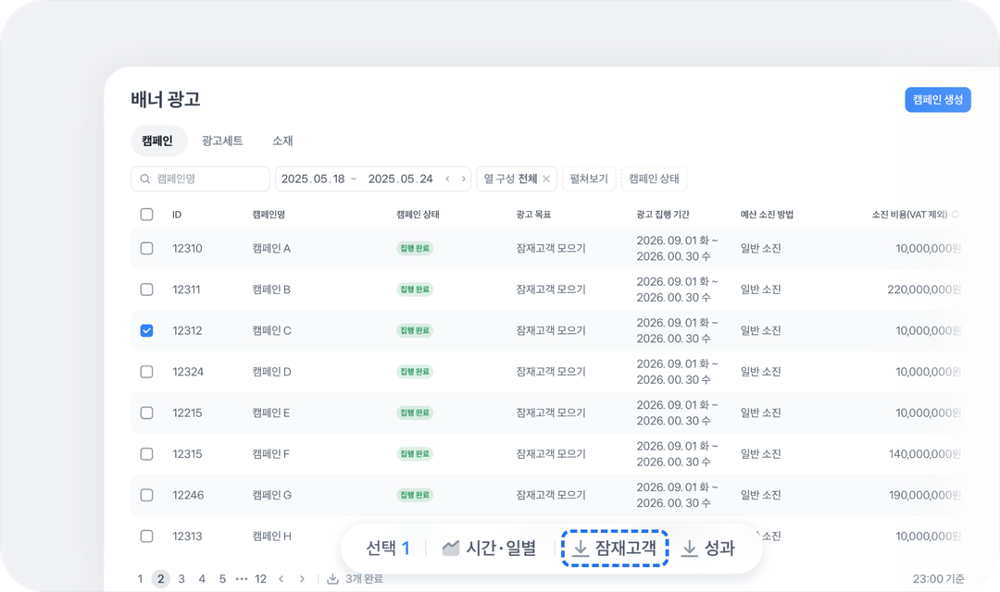

# 잠재고객 모으기 웹훅 연동하기

토스애즈 [잠재고객 모으기](../a-d/banner/creative/basic.md)는 광고 폼에 제출된 잠재고객 정보를 광고주 서버로 자동 전송하는 웹훅을 제공해요. 웹훅을 연동하면 잠재고객 목록을 직접 다운로드하지 않아도 광고주의 CRM, 상담 시스템, 마케팅 자동화 도구로 잠재고객 정보를 바로 받을 수 있어요.

이 가이드에서는 웹훅 등록, 서명 검증, 재전송 정책 등 연동에 필요한 내용을 다뤄요.


**웹훅 연동은 선택 사항이에요.**

웹훅을 연동하지 않아도 잠재고객 목록은 토스애즈 대시보드에서 30일간 엑셀 파일로 다운로드할 수 있어요.


## 잠재고객 모으기 웹훅 동작 방식

잠재고객 모으기 웹훅은 유저가 리드폼을 제출하면 토스애즈가 잠재고객 정보를 HTTPS `POST`로 수신 서버에 보내요.



## 웹훅 사용 설정하기

웹훅을 받으려면 잠재고객 모으기 정보입력 양식에 웹훅 URL을 등록하고 시크릿 키를 받아야 해요.

<figure><figcaption></figcaption></figure>

1. **잠재고객 모으기 정보입력 양식 > 웹훅 연동** 영역에서 **\[사용]** 토글을 켜주세요.


**웹훅 설정은 리드폼 상태와 무관하게 수정할 수 있어요**.

* 리드폼이 심사 중 / 승인 / 반려 상태여도 웹훅 사용 여부를 바꿀 수 있어요.
* 웹훅 URL은 심사 요청 뒤와 승인 뒤에도 수정할 수 있어요.
* 승인된 상태에서도 시크릿 키를 복사하거나 재발급할 수 있어요.
* 웹훅 URL이 등록되어 있어도 이 토글이 꺼져 있으면 웹훅은 발송되지 않아요.


2. **웹훅 URL** 필드에 잠재고객 정보를 받을 HTTPS 주소를 입력해 주세요. 웹훅 URL은 HTTPS만 사용할 수 있어요.
3. **시크릿 키**는 광고계정 단위로 발급돼요. 이미 발급된 키가 있으면 기존 키가 그대로 표시되고, 없으면 자동으로 발급돼요. 복사 버튼으로 환경변수나 보안 저장소에 저장해 주세요. 이 키는 수신 서버에서 요청 데이터가 변조되지 않았는지 검증할 때 사용해요.


**시크릿 키가 노출되었다면 바로 재발급해 주세요**.

시크릿 키가 노출되었다고 의심되면 즉시 재발급해 주세요.


#### 시크릿 키 알아두기

잠재고객 모으기 웹훅은 시크릿 키로 **HMAC-SHA256 서명을 만들어 헤더에 담는 방식**으로 발신자를 인증해요. 수신 서버는 같은 시크릿 키로 서명을 다시 계산해 비교하면 돼요. 자세한 방법은 아래 서명 검증하기에서 확인할 수 있어요.

* **광고계정 단위 발급:** 같은 광고계정의 여러 리드폼은 같은 시크릿 키를 공유해요.
* **자동 발급 또는 기존 키 표시:** 광고계정에 시크릿 키가 없으면 새로 발급돼요. 이미 발급된 키가 있으면 그 키가 그대로 표시돼요.
* **계속 확인 가능:** 시크릿 키는 발급 이후에도 화면에서 계속 확인하고 복사할 수 있어요.
* **재발급:** 키 교체가 필요하면 재발급으로 새 키를 받을 수 있어요. 14일 동안 가장 최근에 발급된 두 키의 서명이 함께 전달될 수 있고, 아래 [시크릿 키 교체하기](webhook.md#undefined-8)에서 자세한 흐름을 안내해요.

#### 발신 IP 허용하기

수신 서버가 방화벽, WAF, 보안 그룹에서 IP 허용 목록을 사용한다면 아래 토스의 outbound IP 대역을 모두 허용해 주세요. 토스는 이중화된 데이터센터에서 요청을 발송하므로 두 대역 모두 등록이 필요해요.

* DC1: `117.52.3.80~87`, `117.52.3.11`
* DC2: `211.115.96.80~87`, `211.115.96.11`


**두 대역을 모두 허용 목록에 등록해 주세요.**

웹훅은 두 센터 중 하나에서 발송될 수 있어요. 한 대역만 허용하면 일부 요청이 차단될 수 있어요.


## 웹훅 살펴보기

토스애즈는 등록된 웹훅 URL로 HTTPS `POST` 요청을 보내요. 헤더에는 서명과 메타데이터, 본문에는 잠재고객 정보가 담겨요.

### 웹훅 헤더

<table><thead><tr><th width="215.84765625">헤더</th><th width="183.29296875">값 예시</th><th>설명</th></tr></thead><tbody><tr><td><code>Content-Type</code></td><td><code>application/json</code></td><td>웹훅 본문은 JSON으로 전달돼요.</td></tr><tr><td><code>X-TossAds-Webhook-Type</code></td><td><code>standard</code></td><td>웹훅 타입이에요. 현재는 <code>standard</code> 한 종류만 사용해요.</td></tr><tr><td><code>X-TossAds-Timestamp</code></td><td><code>1776326400</code></td><td>토스애즈가 웹훅을 보낸 시각이에요. 초 단위 Unix timestamp로 전달돼요. 유저가 리드폼을 제출한 시각은 본문의 <code>lead_submit_time</code>을 사용해 주세요. 처리 지연이 있으면 두 값이 다를 수 있어요.</td></tr><tr><td><code>X-TossAds-Signature</code></td><td><code>v1=ab12cd34...</code></td><td>시크릿 키로 <code>{timestamp}.{body}</code>에 만든 HMAC-SHA256 서명(소문자 hex)이에요. <code>v1</code>은 서명에 사용한 시크릿 키 버전이에요.</td></tr></tbody></table>

### 웹훅 본문

웹훅 본문은 JSON으로 전달돼요.

```json
{
  "api_version": "v1",
  "is_test": false,
  "lead_id": 12345,
  "form_id": 67890,
  "campaign_id": 1001,
  "ad_set_id": 2002,
  "ad_id": 3003,
  "tracking_click_id": "tck_abc",
  "lead_submit_time": "2026-04-15T12:34:56+09:00",
  "user_column_data": [
    { "column_id": "name", "column_name": "이름", "string_value": "홍길동" },
    { "column_id": "phone", "column_name": "연락처", "string_value": "010-1234-5678" }
  ],
  "submitted_content": [
    {
      "id": 1,
      "question": "관심 상품을 선택해 주세요",
      "answer": ["자동차보험"]
    },
    {
      "id": 2,
      "question": "관심 상품을 모두 선택해 주세요",
      "answer": ["자동차보험", "운전자보험"]
    },
    {
      "id": 3,
      "question": "상담 희망 날짜를 선택해 주세요",
      "answer": ["2026-04-20"]
    },
    {
      "id": 4,
      "question": "상담 시 궁금한 점을 자세히 적어 주세요",
      "answer": ["보장 범위와 보험료를 비교하고 싶어요."]
    },
    {
      "id": 5,
      "question": "거주 지역을 적어 주세요",
      "answer": ["강남구"]
    },
    {
      "id": 6,
      "question": "예상 월 예산을 숫자로 적어 주세요",
      "answer": ["50000"]
    }
  ],
  "consensus_histories": [
    { "terms_id": 101, "agreed_at": "2026-04-15T12:34:55+09:00" }
  ]
}
```

<table><thead><tr><th width="200.44921875">필드</th><th width="88.925048828125">타입</th><th width="65.41015625">필수</th><th>설명</th></tr></thead><tbody><tr><td><code>api_version</code></td><td>string</td><td>필수</td><td>페이로드 스키마 버전이에요. 현재는 <code>v1</code>이에요.</td></tr><tr><td><code>is_test</code></td><td>boolean</td><td>필수</td><td>테스트 발송이면 <code>true</code>, 실제 리드면 <code>false</code>예요.</td></tr><tr><td><code>lead_id</code></td><td>number</td><td>필수</td><td>잠재고객 정보의 고유 ID예요. 유저가 폼을 제출할 때 생성돼요. 유저 응답의 중복 처리 기준으로 사용해요.</td></tr><tr><td><code>form_id</code></td><td>number</td><td>필수</td><td>리드폼 양식 ID예요. 하나의 리드폼 양식에 여러 유저가 응답할 수 있어요.</td></tr><tr><td><code>campaign_id</code></td><td>number</td><td>필수</td><td>광고 캠페인(계약) ID예요.</td></tr><tr><td><code>ad_set_id</code></td><td>number</td><td>필수</td><td>광고 세트 ID예요.</td></tr><tr><td><code>ad_id</code></td><td>number</td><td>필수</td><td>광고 소재 ID예요.</td></tr><tr><td><code>tracking_click_id</code></td><td>string</td><td>필수</td><td>광고 클릭 추적용 ID로, 광고 성과 분석(어트리뷰션)에 사용해요.</td></tr><tr><td><code>lead_submit_time</code></td><td>string</td><td>필수</td><td>유저가 리드폼을 제출한 시각이에요. ISO 8601, KST로 전달돼요.</td></tr><tr><td><code>user_column_data</code></td><td>array</td><td>필수</td><td>유저가 입력한 개인정보 항목이에요. 각 항목은 <code>column_id</code>, <code>column_name</code>, <code>string_value</code>로 구성돼요.</td></tr><tr><td><code>submitted_content</code></td><td>array</td><td>선택</td><td><p>유저가 제출한 설문 답변이에요. 각 항목은 아래처럼 구성돼요.<br><br>• <code>id</code> : 질문 ID예요.<br>• <code>question</code> : 질문 텍스트예요.<br>• <code>answer</code> : 유저 답변이에요. 모든 답변은 문자열 배열로 전달돼요.</p><p><br>설문이 없으면 빈 배열이에요.</p></td></tr><tr><td><code>consensus_histories</code></td><td>array</td><td>필수</td><td>유저의 약관 동의 이력이에요. 각 항목은 <code>terms_id</code>(number, 동의문 ID)와 <code>agreed_at</code>(동의 시각)으로 구성돼요.</td></tr></tbody></table>


**새 필드가 추가될 수 있어요**.

웹훅에는 기존 필드를 유지하면서 새 필드가 추가될 수 있어요. 수신 서버는 모르는 필드를 무시하도록 구현해 주세요.


## 수신 서버 만들기

등록한 URL로 들어오는 웹훅을 처리할 수신 서버를 만들어주세요. 수신 서버는 정상 요청만 받아 중복 없이 저장하기 위해 서명을 검증하고, 응답을 보내고, 중복을 처리할 수 있어야 해요.

### 서명 검증하기

토스애즈는 `X-TossAds-Timestamp` 값과 요청 본문을 `.`으로 이어 붙인 `{timestamp}.{body}`를 시크릿 키로 HMAC-SHA256 서명한 값을 `X-TossAds-Signature` 헤더에 담아 보내요. 결과는 소문자 hex로 인코딩돼요(`v1=ab12cd34...`).

웹훅을 받는 서버는 다음 두 가지를 검증해 주세요.

1. **타임스탬프:** `X-TossAds-Timestamp`와 현재 시각의 차이가 5분(300초) 이내인지 확인해요.
2. **서명:** 위에서 발급한 시크릿 키로 `{timestamp}.{body}`에 만든 서명과 헤더의 서명을 대조해요.


**서명 입력값은 원본 그대로 사용해 주세요**.

서명은 HTTP 요청으로 받은 `X-TossAds-Timestamp` 값과 문자 `.` 그리고 본문 원본 바이트를 그대로 이어 붙인 `{timestamp}.{body}`로 계산해야 해요. JSON을 파싱한 뒤 다시 직렬화하면 공백·필드 순서·이스케이프가 달라져 검증에 실패해요.


#### 시크릿 키 교체하기

시크릿 키를 재발급하면, 토스애즈는 **14일 동안** 최근에 발급된 최대 2개의 시크릿 키로 만든 서명을 함께 보낼 수 있어요. 수신 서버에서 새 키로 즉시 교체되지 않아도 무중단으로 전환할 수 있게 하는 안전장치예요.

이 기간에는 헤더에 두 개의 서명이 콤마로 함께 전달돼요.

```
X-TossAds-Signature: v2=bbb222...,v3=ccc333...
```

수신 서버는 두 개의 서명을 콤마로 나눈 뒤, 보유한 시크릿 키로 계산한 서명과 두 값 중 하나라도 일치하면 정상 요청으로 처리하면 돼요. 재발급이 여러 번 일어나더라도 최근에 발급된 두 키 기준으로 서명이 전달돼요. 14일이 지나면 오래된 키는 자동으로 만료되고, 유효한 최신 키 기준의 서명만 남아요.

```
X-TossAds-Signature: v3=ccc333...
```

#### 서명 검증 코드 예시

Kotlin, Java, Python, Node.js로 작성한 수신 서버 예시예요. 서명 검증과 다중 서명 처리 방법이 포함되어 있어요.



```kotlin
import javax.crypto.Mac
import javax.crypto.spec.SecretKeySpec
import java.security.MessageDigest
import java.time.Instant
import kotlin.math.abs

// 토스애즈 대시보드에서 발급받은 시크릿 키 (환경변수 등으로 주입)
@Value("\${toss-ads.webhook.secret-key}")
private lateinit var secretKey: String

/**
 * 웹훅 수신 엔드포인트.
 * body는 raw bytes로 수신해야 한다. JSON 파싱 후 재직렬화하면 바이트가 달라져 서명 검증에 실패한다.
 */
@PostMapping("/webhook/toss-ads")
fun receiveWebhook(
    @RequestHeader("X-TossAds-Timestamp") timestamp: String,
    @RequestHeader("X-TossAds-Signature") signature: String,
    @RequestBody body: ByteArray,
): ResponseEntity<String> {

    // 1. 서명 입력 조립: "{timestamp}.{body}"
    val signingInput = "${timestamp}.".toByteArray() + body

    // 2. HMAC-SHA256 계산 (소문자 hex)
    val mac = Mac.getInstance("HmacSHA256")
    mac.init(SecretKeySpec(secretKey.toByteArray(), "HmacSHA256"))
    val expected = mac.doFinal(signingInput).joinToString("") { "%02x".format(it) }

    // 3. 헤더의 서명을 콤마로 split → 하나라도 매치하면 통과 (듀얼 시그니처 대응)
    val isValid = signature.split(",").any { part ->
        val sigValue = part.trim().substringAfter("=")
        MessageDigest.isEqual(expected.toByteArray(), sigValue.toByteArray())
    }
    if (!isValid) {
        return ResponseEntity.status(401).body("Invalid signature")
    }

    // 4. 서명이 유효한 것을 확인한 뒤에야 타임스탬프를 신뢰할 수 있다.
    //    서명에 타임스탬프가 포함되어 있으므로, 서명 통과 = 타임스탬프 미조작 보장.
    //    이후 ±5분 검증으로 replay attack 방어.
    val requestTime = timestamp.toLongOrNull()
        ?: return ResponseEntity.badRequest().body("Invalid timestamp")
    if (abs(Instant.now().epochSecond - requestTime) > 300) {
        return ResponseEntity.status(401).body("Timestamp expired")
    }

    // 5. 검증 통과 — 페이로드 파싱 후 처리
    val payload = objectMapper.readValue(body, Map::class.java)
    //TODO: lead_id 기준으로 중복 처리 후 저장
    return ResponseEntity.ok("OK")
}
```



```java
import javax.crypto.Mac;
import javax.crypto.spec.SecretKeySpec;
import java.nio.charset.StandardCharsets;
import java.security.MessageDigest;
import java.time.Instant;
import java.util.HexFormat;

@Value("${toss-ads.webhook.secret-key}")
private String secretKey;

/**
 * 웹훅 수신 엔드포인트.
 * body는 raw bytes로 수신해야 한다. JSON 파싱 후 재직렬화하면 바이트가 달라져 서명 검증에 실패한다.
 */
@PostMapping("/webhook/toss-ads")
public ResponseEntity<String> receiveWebhook(
        @RequestHeader("X-TossAds-Timestamp") String timestamp,
        @RequestHeader("X-TossAds-Signature") String signature,
        @RequestBody byte[] body) throws Exception {

    // 1. 서명 입력 조립: "{timestamp}.{body}"
    byte[] prefix = (timestamp + ".").getBytes(StandardCharsets.UTF_8);
    byte[] signingInput = new byte[prefix.length + body.length];
    System.arraycopy(prefix, 0, signingInput, 0, prefix.length);
    System.arraycopy(body, 0, signingInput, prefix.length, body.length);

    // 2. HMAC-SHA256 계산 (소문자 hex)
    Mac mac = Mac.getInstance("HmacSHA256");
    mac.init(new SecretKeySpec(secretKey.getBytes(StandardCharsets.UTF_8), "HmacSHA256"));
    String expected = HexFormat.of().formatHex(mac.doFinal(signingInput));

    // 3. 헤더의 서명을 콤마로 split → 하나라도 매치하면 통과 (듀얼 시그니처 대응)
    boolean isValid = false;
    for (String part : signature.split(",")) {
        String sigValue = part.trim().split("=", 2)[1];
        if (MessageDigest.isEqual(
                expected.getBytes(StandardCharsets.UTF_8),
                sigValue.getBytes(StandardCharsets.UTF_8))) {
            isValid = true;
            break;
        }
    }
    if (!isValid) {
        return ResponseEntity.status(401).body("Invalid signature");
    }

    // 4. 서명이 유효한 것을 확인한 뒤에야 타임스탬프를 신뢰할 수 있다.
    //    서명에 타임스탬프가 포함되어 있으므로, 서명 통과 = 타임스탬프 미조작 보장.
    //    이후 ±5분 검증으로 replay attack 방어.
    long requestTime = Long.parseLong(timestamp);
    if (Math.abs(Instant.now().getEpochSecond() - requestTime) > 300) {
        return ResponseEntity.status(401).body("Timestamp expired");
    }

    // 5. 검증 통과 — 페이로드 파싱 후 처리
    //TODO: lead_id 기준으로 중복 처리 후 저장
    return ResponseEntity.ok("OK");
}
```



```python
import hmac
import hashlib
import time
import json
import os
from flask import Flask, request

app = Flask(__name__)

# 토스애즈 대시보드에서 발급받은 시크릿 키 (환경변수로 주입)
SECRET_KEY = os.environ["TOSS_ADS_WEBHOOK_SECRET_KEY"]

@app.route("/webhook/toss-ads", methods=["POST"])
def receive_webhook():
    timestamp = request.headers.get("X-TossAds-Timestamp")
    signature = request.headers.get("X-TossAds-Signature")

    if not timestamp or not signature:
        return "Missing required header", 400

    # body는 raw bytes로 수신해야 한다. JSON 파싱 후 재직렬화하면 바이트가 달라져 서명 검증에 실패한다.
    raw_body = request.get_data()

    # 1. 서명 입력 조립: "{timestamp}.{body}"
    signing_input = f"{timestamp}.".encode("utf-8") + raw_body

    # 2. HMAC-SHA256 계산 (소문자 hex)
    expected = hmac.new(SECRET_KEY.encode("utf-8"), signing_input, hashlib.sha256).hexdigest()

    # 3. 헤더의 서명을 콤마로 split → 하나라도 매치하면 통과 (듀얼 시그니처 대응)
    is_valid = any(
        hmac.compare_digest(expected, part.strip().split("=", 1)[1])
        for part in signature.split(",")
    )
    if not is_valid:
        return "Invalid signature", 401

    # 4. 서명이 유효한 것을 확인한 뒤에야 타임스탬프를 신뢰할 수 있다.
    #    서명에 타임스탬프가 포함되어 있으므로, 서명 통과 = 타임스탬프 미조작 보장.
    #    이후 ±5분 검증으로 replay attack 방어.
    if abs(int(time.time()) - int(timestamp)) > 300:
        return "Timestamp expired", 401

    # 5. 검증 통과 — 페이로드 파싱 후 처리
    payload = json.loads(raw_body)
    #TODO: lead_id 기준으로 중복 처리 후 저장
    return "OK", 200
```



```javascript
const express = require('express');
const crypto = require('crypto');

const app = express();
const SECRET_KEY = process.env.TOSS_ADS_WEBHOOK_SECRET_KEY;

// body는 raw bytes로 수신해야 한다. express.json() 대신 express.raw() 사용.
// JSON 파싱 후 재직렬화하면 바이트가 달라져 서명 검증에 실패한다.
app.post(
  '/webhook/toss-ads',
  express.raw({ type: 'application/json' }),
  (req, res) => {
    const timestamp = req.header('X-TossAds-Timestamp');
    const signature = req.header('X-TossAds-Signature');

    if (!SECRET_KEY || !timestamp || !signature) {
      return res.status(400).send('Missing required header');
    }

    // 1. 서명 입력 조립: "{timestamp}.{body}"
    const signingInput = Buffer.concat([
      Buffer.from(`${timestamp}.`, 'utf8'),
      req.body,
    ]);

    // 2. HMAC-SHA256 계산 (소문자 hex)
    const expected = crypto
      .createHmac('sha256', SECRET_KEY)
      .update(signingInput)
      .digest('hex');

    // 3. 헤더의 서명을 콤마로 split → 하나라도 매치하면 통과 (듀얼 시그니처 대응)
    //    crypto.timingSafeEqual()은 상수 시간 비교(constant-time comparison) 함수.
    //    일반 === 로 비교해도 결과는 같지만, === 는 첫 번째 다른 바이트에서 바로 반환하므로
    //    응답 시간 차이로 서명을 추측하는 타이밍 공격에 이론적으로 취약하다.
    //    상수 시간 비교는 입력과 무관하게 항상 같은 시간이 걸려 이를 방지한다.
    const isValid = signature.split(',').some((part) => {
      const sigValue = part.trim().split('=')[1];
      const a = Buffer.from(expected, 'hex');
      const b = Buffer.from(sigValue, 'hex');
      return a.length === b.length && crypto.timingSafeEqual(a, b);
    });

    if (!isValid) return res.status(401).send('Invalid signature');

    // 4. 서명이 유효한 것을 확인한 뒤에야 타임스탬프를 신뢰할 수 있다.
    //    서명에 타임스탬프가 포함되어 있으므로, 서명 통과 = 타임스탬프 미조작 보장.
    //    이후 ±5분 검증으로 replay attack 방어.
    const now = Math.floor(Date.now() / 1000);
    if (Math.abs(now - Number(timestamp)) > 300) {
      return res.status(401).send('Timestamp expired');
    }

    // 5. 검증 통과 — 페이로드 파싱 후 처리
    const payload = JSON.parse(req.body.toString('utf8'));
    //TODO: lead_id 기준으로 중복 처리 후 저장
    res.status(200).send('OK');
  }
);

app.listen(3000);
```




**같은 리드는 한 번만 처리해 주세요**.

같은 리드가 두 번 이상 도달하거나 도착 순서가 제출 순서와 다를 수 있어요. `lead_id` 기준으로 멱등 처리해 주세요. 이미 처리한 `lead_id`는 새로 저장하지 않고 `200 OK`만 반환하면 돼요.


### 응답 보내기

훅을 받았다면 토스애즈로 응답을 보내주세요. `2xx(200~299)`만 성공으로 처리해요. 그 외 모든 응답과 응답 없음은 실패로 처리해요.

<table><thead><tr><th width="199.11328125">응답</th><th>토스애즈 서버 동작</th></tr></thead><tbody><tr><td><code>2XX</code></td><td>정상 수신으로 처리해요.</td></tr><tr><td>그 외 모든 응답 또는 응답 없음(타임아웃)</td><td>실패로 처리하고 재전송 정책에 따라 최대 2번 다시 보내요.</td></tr></tbody></table>


**연결된 뒤에는 5초 안에 응답해 주세요**.

토스애즈는 연결 3초, 응답 대기 5초 타임아웃을 적용해요. 연결이 된 뒤에는 5초 안에 `2xx`를 반환해 주세요. 무거운 작업은 응답 후 비동기로 처리해 주세요.


#### 재전송 정책 확인하기

실패한 요청은 같은 웹훅을 **5분 간격으로 최대 2회 재전송**해요. 최초 발송까지 포함하면 총 3번 시도해요.

| 시도     | 시점    |
| ------ | ----- |
| 최초 전송  | 0분    |
| 1차 재전송 | 5분 후  |
| 2차 재전송 | 10분 후 |


**재전송이 모두 실패해도 목록은 내려받을 수 있어요**.

3회 모두 실패해도 잠재고객 목록은 토스애즈 대시보드에서 30일간 엑셀로 다운로드할 수 있어요.


## 테스트 발송

**잠재고객 모으기 정보입력 양식 > 웹훅 연동** 영역의 **\[테스트 발송]** 버튼을 누르면 `is_test: true`인 고정 더미 페이로드(`lead_id`를 포함하고, 이름은 `홍길동`, 연락처는 `010-0000-0000` 등)가 등록된 URL로 전송돼요. 실제 요청과 동일하게 서명되므로 검증 로직까지 함께 검증할 수 있어요.

<figure><figcaption></figcaption></figure>


**테스트 데이터는 실제 리드와 분리해 주세요**.

`is_test: true` 데이터는 실제 리드와 섞이지 않게 분리해서 저장해 주세요.


## 실제 서비스 전 점검하기

라이브 광고에 적용하기 전에 다음을 확인해 주세요. 가급적 적은 예산의 캠페인으로 검증한 뒤 확대해 주세요.

* [ ] 웹훅 URL이 HTTPS이고, 외부에서 접근 가능해요.
* [ ] 시크릿 키가 환경변수나 보안 저장소에만 저장되어 있어요.
* [ ] 방화벽 허용 목록에 토스 outbound IP 두 대역을 모두 추가했어요.
* [ ] 서명 검증이 `{timestamp}.{body}` 기준으로 구현되어 있어요.
* [ ] `lead_id` 기준으로 중복 처리가 적용돼 있어요.
* [ ] 연결된 뒤 5초 안에 `2xx`를 반환할 수 있도록 무거운 작업을 비동기로 분리했어요.
* [ ] 4XX·5XX 에러를 추적할 수 있는 로그·모니터링이 설정돼 있어요.
* [ ] `is_test: true` 데이터를 실제 리드와 구분해서 저장해요.

## 문제 해결하기

웹훅을 연동할 때 자주 발생하는 문제를 확인해 보세요.

### 웹훅 전송 실패

정보입력 양식 웹훅 전송에 실패했다는 이메일을 받으셨다면 아래 내용에 따라 문제를 해결해 주세요.



#### **연결 상태 확인하기**

* 웹훅 URL이 정확히 등록되어 있는지, HTTPS인지 확인해 주세요.
* 외부에서 접근 가능한 URL인지, 방화벽이 요청을 차단하지 않는지 확인해 주세요.
* 서버가 연결된 뒤 5초 이내에 응답하는지 확인해 주세요.



#### **테스트 발송 확인하기**

[테스트 발송](webhook.md#undefined-13)을 시도해서 데이터가 정상적으로 전송되는지 검증해 주세요.


**테스트 발송은 성공하지만 실제 리드가 들어오지 않아요.**

* 실제 리드폼에도 웹훅 URL이 등록되어 있는지 확인해 주세요.
* `is_test` 분기 처리가 실제 리드 저장을 막고 있지 않은지 확인해 주세요.
* 서버 로그에서 4XX·5XX·타임아웃이 발생했는지 확인해 주세요.




#### **누락된 잠재고객 목록 받기 (선택)**

토스애즈 광고 상품 대시보드에서 해당 캠페인을 선택한 뒤 하단 **\[잠재고객]** 버튼을 누르면 목록을 받을 수 있어요. 정보 수집 시점부터 30일간 엑셀 파일로 다운로드할 수 있고, 받을 내역이 없으면 버튼이 비활성화돼요.

<figure><figcaption></figcaption></figure>



### 서명 검증 실패

서명이 맞지 않는 건 대부분 서명 계산에 쓴 입력값이 토스애즈가 보낸 원본과 달라서예요. 아래에서 해당하는 원인을 찾아 수정해 주세요.

<table><thead><tr><th width="324.5382080078125">원인</th><th>해결 방법</th></tr></thead><tbody><tr><td>JSON 파싱 후 다시 직렬화한 값으로 서명 계산</td><td><code>X-TossAds-Timestamp + "." + raw body</code>로 서명을 계산하도록 수정</td></tr><tr><td>타임스탬프를 빼고 서명 계산</td><td><code>X-TossAds-Timestamp</code> 값을 서명 입력값에 함께 포함하도록 수정</td></tr><tr><td>최근 2개 서명 미처리</td><td>서명 값을 콤마로 나눈 뒤, 하나라도 일치하면 통과하도록 구현</td></tr></tbody></table>

### 같은 리드를 여러 번 수신

웹훅은 재전송이나 네트워크 상황에 따라 같은 리드가 여러 번 전달될 수 있어요. `lead_id`를 기준으로 한 번만 저장하도록 멱등 처리해 주세요.

### 5초 내 응답하기 어려움

웹훅을 받으면 수신 서버가 5초 안에 `200 OK`를 보내줘야 해요. CRM 저장 같은 무거운 작업을 응답 전에 처리하면 이 시간을 넘기기 쉬워요.

요청을 받은 즉시 큐나 작업 테이블에만 저장하고 200 OK를 먼저 응답해 주세요. CRM 저장 같은 무거운 작업은 그 뒤에 비동기로 처리해 주세요.
