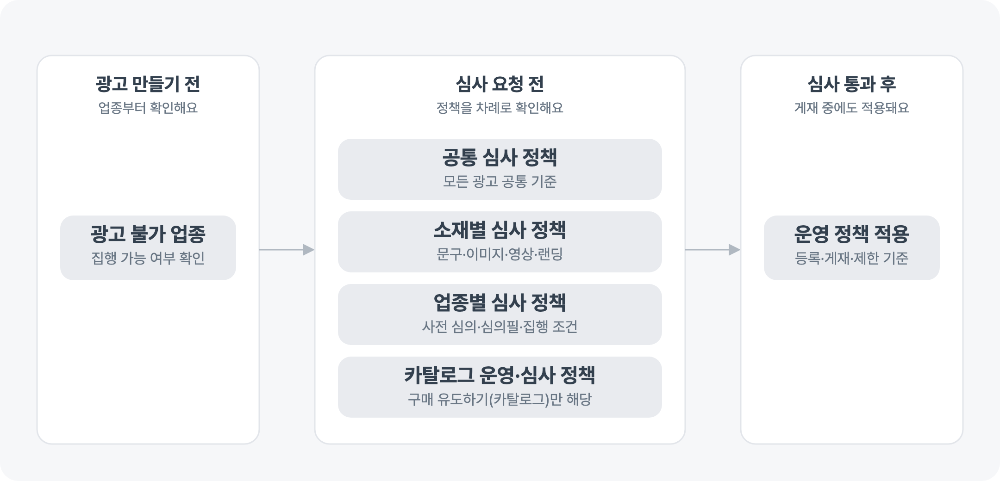

---
layout:
  width: default
  title:
    visible: true
  description:
    visible: false
  tableOfContents:
    visible: true
  outline:
    visible: true
  pagination:
    visible: false
  metadata:
    visible: false
  tags:
    visible: true
  actions:
    visible: true
---

# 심사·운영 정책 알아보기

광고를 게재하려면 심사를 통과해야 하고, 게재 중에는 운영 정책이 적용돼요. 광고를 만들기 전에 집행할 수 있는 업종인지 확인하고, 광고에 적용되는 심사 기준을 살펴보세요. 공통 정책, 사용한 소재의 정책, 업종별 정책을 차례로 확인하고, 구매 유도하기(카탈로그) 광고라면 카탈로그 운영·심사 정책까지 확인하면 심사를 요청하기 전에 필요한 내용을 점검할 수 있어요.

<figure><figcaption></figcaption></figure>

## 광고할 수 있는 업종인지 확인하기

광고를 만들기 전에 집행이 불가하거나 제한될 수 있는 업종인지 확인해요.


[restrictedindustry.md](restrictedindustry.md)


## 모든 광고에 적용되는 기준 확인하기

심사 진행 방식, 모든 광고가 지켜야 하는 기준, 광고 운영 중 제한될 수 있는 행위를 확인해요.


[basicguide.md](basicguide.md)


## 소재별 기준 확인하기

광고에 사용한 문구, 이미지, 동영상, 랜딩 페이지와 딥링크에 적용되는 기준을 확인해요. 광고가 반려됐다면 반려 사유와 관련된 기준도 이 문서에서 찾아볼 수 있어요.


[creativeguide.md](creativeguide.md)


## 업종별 기준 확인하기

사전 심의, 심의필 기재, 별도 집행 조건이 필요한 업종인지 확인해요.


[industryguide.md](industryguide.md)


## 카탈로그 광고 기준 확인하기

구매 유도하기(카탈로그) 광고를 집행한다면 상품 정보, 상품 이미지, 랜딩 페이지, 모니터링과 제재 기준을 확인해요.


[catalog.md](catalog.md)


## 광고 게재 중 적용되는 운영 정책 확인하기

토스애즈 약관의 일부를 구성하는 운영 정책 원문이에요. 광고의 등록·검수·게재·제한 기준과 집행 취소·위약금, 정산 규정을 확인해요.


[policy-1.md](policy-1.md)


## 심사를 요청하기 전에 점검하기

* 광고할 수 있는 업종인지 확인해요.
* 모든 광고에 적용되는 공통 심사 정책을 확인해요.
* 사용한 소재와 랜딩 페이지에 적용되는 정책을 확인해요.
* 업종별 필수 문구와 집행 조건을 확인해요.
* 구매 유도하기(카탈로그) 광고라면 카탈로그 운영·심사 정책을 확인해요.
* 상품별 소재 규격은 디스플레이 광고 또는 리워드 광고의 소재 가이드에서 확인해요.

심사를 통과한 뒤에도 광고가 게재되는 동안에는 운영 정책이 계속 적용돼요.
