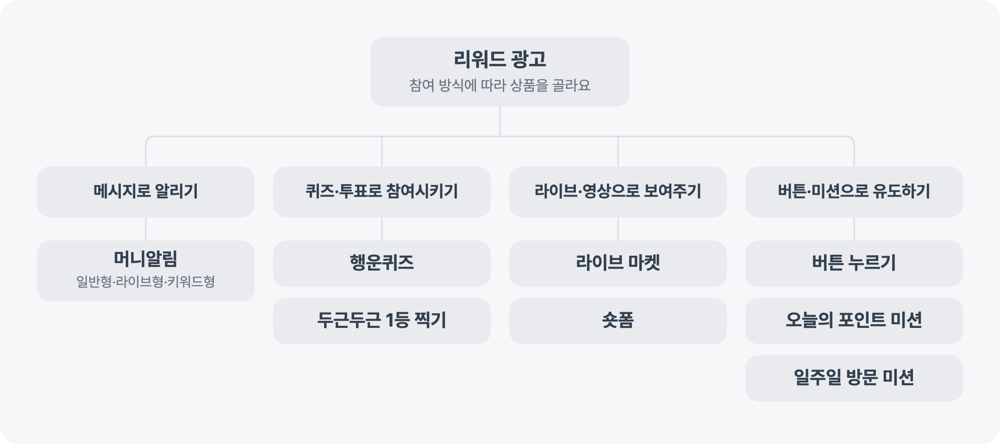

---
layout:
  width: default
  title:
    visible: true
  description:
    visible: false
  tableOfContents:
    visible: true
  outline:
    visible: true
  pagination:
    visible: true
  metadata:
    visible: true
  tags:
    visible: true
  actions:
    visible: true
---

# 리워드 광고 알아보기

리워드 광고는 메시지·퀴즈·라이브·숏폼·버튼·미션 등 다양한 방식으로 사용자에게 알리거나 참여를 유도하는 광고예요. 원하는 방식과 유도하려는 행동에 맞춰 상품을 선택해요. 리워드 제공 여부와 참여 방식은 상품마다 달라요.

<figure><figcaption></figcaption></figure>

## 원하는 방식에 따라 상품 고르기

### 메시지로 알리기

설정한 대상에게 메시지를 보내거나 라이브 방송 시작과 특정 결제 발생 시점에 맞춰 알림을 보내려면 머니알림을 선택해요. 일반형, 라이브형, 키워드형 가운데 목적에 맞는 유형을 고를 수 있어요.


[money-notifications](money-notifications/)


### 퀴즈와 투표로 참여시키기

사용자가 퀴즈에 참여한 뒤 광고주 페이지로 이동하게 하려면 행운퀴즈를 선택해요.


[luckyquiz](luckyquiz/)


여러 상품을 함께 보여주고 사용자가 질문에 맞춰 상품에 투표하게 하려면 두근두근 1등 찍기를 선택해요.


[catalog\_vote](catalog_vote/)


### 라이브와 영상으로 보여주기

토스 앱에서 라이브 방송을 소개하고 방송으로 연결하려면 라이브 마켓을 선택해요.


[liveshopping](liveshopping/)


정해진 시간에 숏폼 영상을 노출하려면 숏폼을 선택해요.


[shortform](shortform/)


### 버튼과 미션으로 행동 유도하기

사용자가 버튼이나 상품 이미지를 누르고 광고주가 지정한 페이지로 이동하게 하려면 버튼 누르기를 선택해요.


[buttonpress](buttonpress/)


회원가입, 앱 실행, 소셜 미디어 팔로우처럼 한 번 또는 여러 단계로 구성된 미션을 운영하려면 오늘의 포인트 미션을 선택해요.


[weeklymission.md](weeklymission.md)


사용자가 7일 동안 쇼핑몰이나 상품 페이지에 반복해서 방문하는 미션을 운영하려면 일주일 방문 미션을 선택해요.


[visitmission.md](visitmission.md)


각 상품 문서에서 현재 제공되는 집행 방법과 조건을 확인할 수 있어요.
