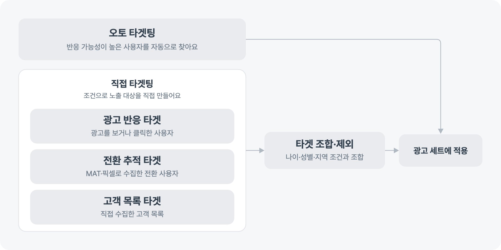

---
layout:
  width: default
  title:
    visible: true
  description:
    visible: false
  tableOfContents:
    visible: true
  outline:
    visible: true
  pagination:
    visible: true
  metadata:
    visible: true
  tags:
    visible: true
  actions:
    visible: true
---

# 타겟 설정 알아보기

타겟은 광고를 보여줄 사용자의 범위예요. 토스애즈의 타겟팅은 광고에 반응할 가능성이 높은 사용자를 자동으로 찾는 **오토 타겟팅**과, 광고주가 노출 대상을 정하는 **직접 타겟팅**으로 나뉘어요.

<figure><figcaption></figcaption></figure>

<figure><figcaption></figcaption></figure>

## 타겟팅 방식 정하기

오토 타겟팅은 토스애즈가 캠페인 목표에 맞는 사용자를 자동으로 찾아요. 직접 타겟팅은 광고 반응, 전환 이벤트, 고객 목록 등의 조건으로 광고주가 대상을 만들고 적용해요.

캠페인 목표와 등록 방식에 따라 사용할 수 있는 타겟팅이 다르므로, 직접 타겟을 만들기 전에 해당 캠페인 문서에서 지원 여부를 확인해 주세요.

## 직접 타겟 만들기

### 이전 광고 반응으로 만들기

기존 광고를 보거나 클릭한 사용자에게 다시 광고를 보여주려면 광고 반응 타겟을 만들어요.


[retarget.md](retarget.md)


### 앱·웹 전환으로 만들기

앱 광고 성과 측정 연동(MAT)이나 웹 광고 성과 측정 연동(토스 픽셀)으로 수집한 전환 이벤트가 발생한 사용자를 대상으로 삼으려면 전환 추적 타겟을 만들어요.


[switch.md](switch.md)


### 고객 목록으로 만들기

직접 수집한 고객 목록을 광고에 활용하려면 고객 목록 타겟을 만들어요.


[list.md](list.md)


## 만든 타겟 조합·제외하기

나이·성별·지역 등의 조건과 만든 타겟을 조합하거나 광고에서 제외할 대상을 설정해요. 자주 사용하는 조합은 저장해 다시 쓸 수 있어요.


[combinations.md](combinations.md)

