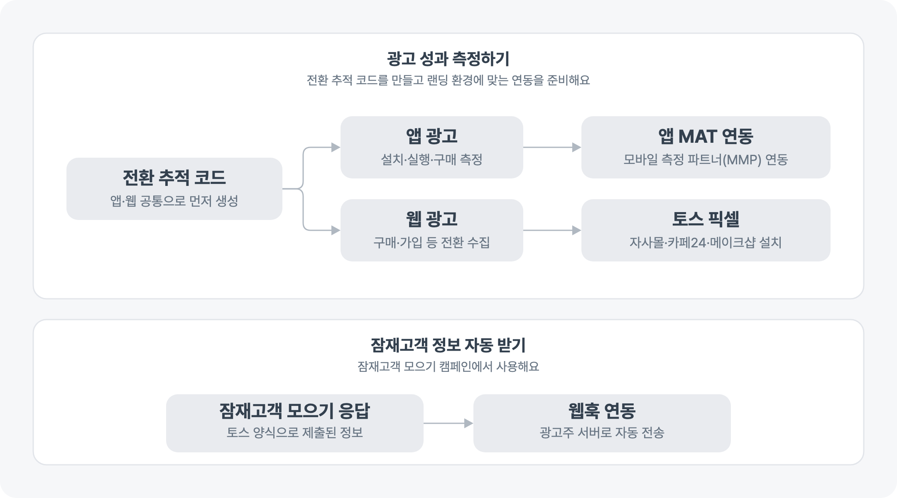

---
layout:
  width: default
  title:
    visible: true
  description:
    visible: false
  tableOfContents:
    visible: true
  outline:
    visible: true
  pagination:
    visible: true
  metadata:
    visible: true
  tags:
    visible: true
  actions:
    visible: true
---

# 광고 성과 측정 연동 알아보기

광고 성과를 측정하거나 잠재고객 정보를 자동으로 받으려면 캠페인 목적과 랜딩 환경에 맞는 연동을 준비해요. 모든 광고에 같은 연동이 필요한 것은 아니니, 만들려는 캠페인 문서에서 필요한 연동을 먼저 확인해 주세요.

<figure><figcaption></figcaption></figure>

## 전환 추적 코드 준비하기

앱 또는 웹 광고 성과 측정에 사용할 전환 추적 코드를 만들고 관리해요. 기존 코드를 공유·이관하거나 지원하는 전환 이벤트와 연동 상태도 확인할 수 있어요.


[tag](tag/)


## 앱 광고 성과 측정하기

앱에서 발생한 설치·실행·구매 등의 성과를 측정하려면 사용 중인 모바일 측정 파트너(MMP)에 맞는 연동 문서를 확인해요.


[mat](mat/)


## 웹 광고 성과 측정하기

웹사이트에서 발생한 전환 이벤트를 수집하려면 토스 픽셀을 설치해요. 자사몰, 카페24, 메이크샵 가운데 사용하는 환경에 맞는 설치 문서를 확인할 수 있어요.


[tosspixel](tosspixel/)


앱과 웹을 모두 랜딩으로 사용한다면 두 환경에 필요한 연동을 각각 준비해요.

## 잠재고객 정보를 자동으로 받기

잠재고객 모으기 캠페인에서 제출된 정보를 광고주 서버로 자동 전송하려면 웹훅을 연동해요.


[webhook.md](webhook.md)

